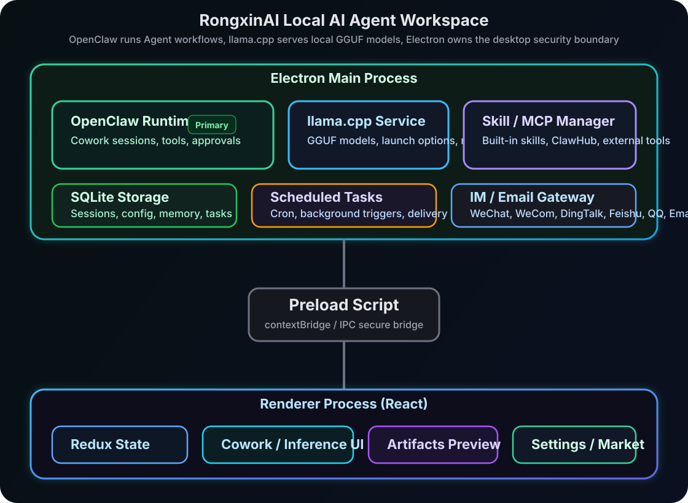

# 知远智能体 (ZhiYuan Agent)

<p align="center">
  
</p>

<p align="center">
  <strong>An all-in-one local AI Agent workspace with a fully self-developed stack</strong>
</p>

<p align="center">
  <a href="LICENSE"></a>
  <br>
  
  <br>
  
  
  
  
  
</p>

<p align="center">
  English | <a href="README_zh.md">中文</a>
</p>

---

ZhiYuan Agent (知远智能体) is a local-first desktop AI Agent workspace by 北京容芯致远, built for development, research, automation, and personal productivity. Its agent runtime and local inference engine are developed in-house, and it integrates built-in skills, MCP integrations, scheduled tasks, and IM or email reachability in one application.

ZhiYuan Agent is not just a chat UI. It is an execution environment where an Agent can work on your machine, request approval for sensitive tools, manage local GGUF models, run recurring tasks, and stay reachable from desktop and mobile channels.

## Key Features

- **Cowork agent workflows**: Run multi-step tasks with file tools, shell commands, browser automation, document processing, and approval-gated actions.
- **Local inference**: Manage local GGUF models, tune the inference service, and connect local models to Agent workflows.
- **Model marketplace**: Search GGUF models from ModelScope and install them into the app-managed model directory.
- **Skills and MCP**: Use built-in skills and connect external tools or internal services through MCP.
- **Scheduled tasks**: Create recurring jobs for briefings, follow-ups, inbox cleanup, reports, and other background work.
- **IM and email channels**: Reach the Agent through WeChat, WeCom, DingTalk, Feishu/Lark, QQ, and email.
- **Local data and permission control**: Sessions, config, and task metadata stay in local SQLite; risky tool calls require approval.

## How It Works

<p align="center">
  
</p>

ZhiYuan Agent uses Electron with strict process isolation. The Renderer hosts the React UI, Preload exposes controlled IPC through `contextBridge`, and the Main Process manages agent sessions, the local inference lifecycle, local storage, skills, MCP integrations, and messaging gateways.

## Quick Start

### Requirements

- Node.js `>=24 <25`
- Bun `>=1.3` (package manager; `npm run` equivalents work for all scripts)

### Local Development

```bash
git clone https://github.com/rongxinzy/RongxinAI.git RongxinAI
cd RongxinAI
bun install
bun run electron:dev
```

The Vite dev server runs at `http://localhost:5175` by default.

### Full-Stack Development (Agent Runtime + Local Inference)

```bash
bun run electron:dev:openclaw
```

This command prepares the built-in agent runtime and the local inference runtime for the current host, then starts the Electron development app.

## Build And Package

```bash
bun run build              # TypeScript typecheck + Vite production build
bun run lint               # oxlint
bun run format             # oxfmt (check: bun run format:check)
bun test                   # Vitest
bun run compile:electron   # Electron main process only
```

Platform packages:

```bash
bun run dist:mac
bun run dist:win
bun run dist:linux
```

The packaged desktop app ships with the agent runtime included. The local inference stack is managed separately through the app scripts.

## Core Modules

### Cowork

Cowork is the primary session system. A task is sent from the Renderer to the Main Process through IPC, then dispatched to the built-in agent runtime. Messages, permission requests, tool state, and completion events stream back to the UI in real time.

Key stream events:

| Event | Description |
| --- | --- |
| `message` | A new message enters the session |
| `messageUpdate` | Incremental streaming content update |
| `permissionRequest` | A tool call requires approval |
| `complete` | The session has finished |
| `error` | The session failed |

### Local Inference

The local inference workspace manages the app-owned inference service, local GGUF models, the ModelScope-backed marketplace, and per-model launch parameters such as context length, GPU offload layers, threads, batch size, main GPU, memory mapping, and keep-alive.

If `modelsDir` is configured in the service settings, the custom path takes precedence over the default model directory.

### Skills And MCP

The `SKILLs/` directory contains built-in skills, and `SKILLs/skills.config.json` controls default enablement and ordering. MCP settings connect external tool services such as GitHub, browsers, databases, file systems, and internal enterprise systems.

Common built-in skills:

| Skill | Purpose |
| --- | --- |
| `web-search` | Search and research |
| `docx` / `xlsx` / `pptx` / `pdf` | Office and document processing |
| `playwright` | Browser automation |
| `remotion` | Video generation |
| `imap-smtp-email` | Email send and receive |
| `stock-*` | Investment research and announcements |
| `skill-creator` | Custom skill creation |

### Scheduled Tasks

Scheduled tasks can be created from natural language or through the GUI. When a task runs, ZhiYuan Agent starts a Cowork session, keeps the result in the desktop app, and can optionally deliver notifications through configured IM or email channels.

## Tech Stack

| Layer | Technology |
| --- | --- |
| Desktop | Electron 40 |
| Frontend | React 19 + TypeScript 7 |
| Build | Vite 8 (Rolldown) |
| Styling | Tailwind CSS 4 |
| Tooling | Bun (package manager), oxlint, oxfmt |
| State | Redux Toolkit |
| Agent runtime | Self-developed |
| Local inference | Self-developed (GGUF models) |
| Storage | better-sqlite3 |
| Rendering | react-markdown / Mermaid / KaTeX |

## License

[MIT License](LICENSE)
