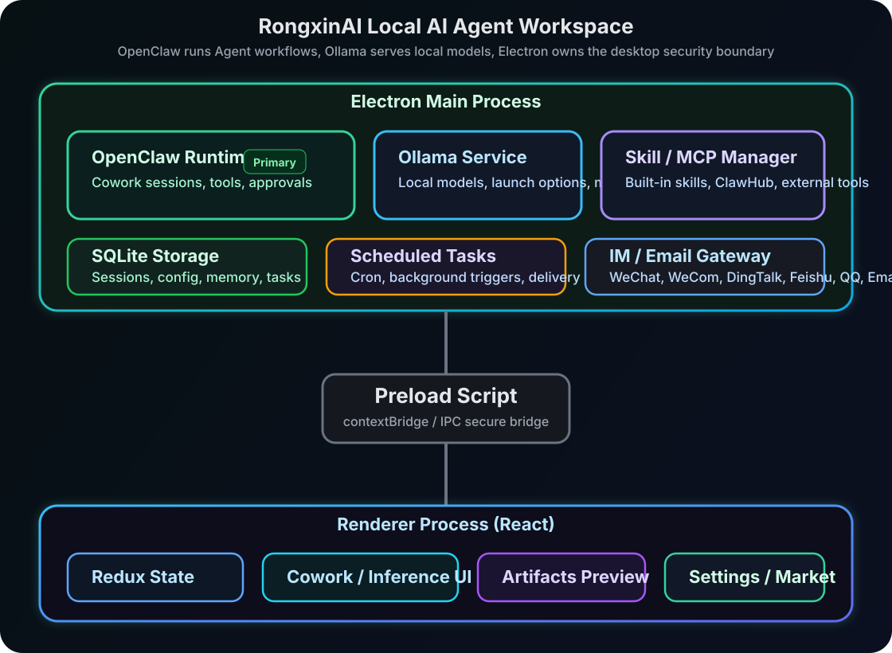

# RongxinAI

<p align="center">
  
</p>

<p align="center">
  <strong>A local AI Agent workspace powered by OpenClaw and llama.cpp</strong>
</p>

<p align="center">
  <a href="LICENSE"></a>
  <br>
  
  <br>
  
  
</p>

<p align="center">
  English · <a href="README_zh.md">中文</a>
</p>

---

RongxinAI is a local-first desktop AI Agent workspace. It brings together the **OpenClaw Agent runtime**, **llama.cpp local model inference**, skills, MCP extensions, scheduled tasks, and IM/email reachability in one application for productivity automation, data analysis, document generation, research, and personal assistant workflows.

It is not just a chat client. RongxinAI is designed as an execution environment where an Agent can work on your machine, request tool permissions, run recurring tasks, use local models, and be triggered from desktop or mobile channels.

## Key Features

- **OpenClaw Agent workflows**: Run file operations, shell commands, browser tasks, document processing, and multi-step work through Cowork sessions.
- **llama.cpp local inference**: Manage local GGUF models, install and load models, configure launch parameters, and connect local models to OpenClaw.
- **Skills system**: Built-in skills for documents, spreadsheets, presentations, PDFs, web search, browser automation, video generation, investment research, and email.
- **MCP extensions**: Configure MCP servers to connect external tools and data sources to the Agent.
- **Scheduled tasks**: Create recurring jobs from natural language or the GUI, such as daily briefings, inbox cleanup, and periodic reports.
- **IM/email reachability**: Supports WeChat, WeCom, DingTalk, Feishu/Lark, QQ, and email.
- **Permission gating**: Sensitive file, terminal, and network tool calls require user approval.
- **Local data storage**: Sessions, configuration, memories, and task metadata are stored in local SQLite.
- **Cross-platform desktop**: macOS, Windows, and Linux; Windows packages can include a portable Python runtime.

## How It Works

<p align="center">
  
</p>

RongxinAI uses Electron with strict process isolation. The Renderer hosts the React UI, Preload exposes controlled IPC through `contextBridge`, and the Main Process manages local storage, OpenClaw runtime lifecycle, llama.cpp service control, skill/MCP orchestration, and IM/email gateways.

## Quick Start

### Requirements

- Node.js `>=24 <25`
- npm

### Local Development

```bash
git clone https://github.com/rongxinzy/RongxinAI.git RongxinAI
cd RongxinAI
npm install
npm run electron:dev
```

The dev server runs at `http://localhost:5175` by default.

### Develop With OpenClaw Runtime

```bash
npm run electron:dev:openclaw
```

This command checks out the OpenClaw version pinned in `package.json`, builds the runtime, and starts the Electron app. The default OpenClaw source path is `../openclaw`; override it with:

```bash
OPENCLAW_SRC=/path/to/openclaw npm run electron:dev:openclaw
```

Common OpenClaw build variables:

| Variable | Description |
|----------|-------------|
| `OPENCLAW_SRC` | Path to the OpenClaw source directory |
| `OPENCLAW_FORCE_BUILD=1` | Force a runtime rebuild |
| `OPENCLAW_SKIP_ENSURE=1` | Skip automatic OpenClaw version checkout for local debugging |

## Build And Package

```bash
# Type check and Vite build
npm run build

# ESLint
npm run lint

# Build OpenClaw runtime for the current host
npm run openclaw:runtime:host
```

Platform packages:

```bash
npm run dist:mac
npm run dist:win
npm run dist:linux
```

Desktop packages include a prebuilt OpenClaw runtime in the application resources. Windows packaging also prepares a portable Python runtime for Python-based skills; third-party Python packages are installed on demand by skills.

## Main Modules

### Cowork

Cowork is RongxinAI's core session system. A user task is sent from the Renderer to the Main Process through IPC, then dispatched to the OpenClaw runtime. Messages, tool calls, permission requests, and completion status stream back to the UI in real time.

Key stream events:

| Event | Description |
|-------|-------------|
| `message` | A new message enters the session |
| `messageUpdate` | Incremental streaming content update |
| `permissionRequest` | A tool call needs approval |
| `complete` | The session has finished |
| `error` | The session failed |

### llama.cpp Local Inference

The local inference page manages the llama.cpp service, local GGUF models, the model marketplace, and model launch parameters. Model-level parameters cover runtime launch and request behavior, including context length, GPU offload layers, threads, batch size, main GPU, memory mapping, and keep-alive. Service-level parameters apply to the managed `llama-server` process and take effect after starting or restarting the llama.cpp service.

### Skills And MCP

The `SKILLs/` directory contains built-in skills, and `SKILLs/skills.config.json` controls default enablement and ordering. The skills marketplace discovers and installs remote skills. MCP settings connect external tool services such as GitHub, browsers, file systems, databases, or internal enterprise services.

Common built-in skills:

| Skill | Purpose |
|-------|---------|
| `web-search` | Search and research |
| `docx` / `xlsx` / `pptx` / `pdf` | Office and document processing |
| `playwright` | Browser automation |
| `remotion` | Video generation |
| `imap-smtp-email` | Email send/receive |
| `stock-*` | Investment research and announcements |
| `skill-creator` | Create custom skills |

### Scheduled Tasks

Scheduled tasks can be created from natural language or configured in the GUI. When a task fires, RongxinAI starts a Cowork session, keeps the result in the desktop app, and can optionally deliver notifications through configured IM/email channels.

### IM And Email

This README documents the channels currently intended for product exposure and maintenance:

| Channel | Description |
|---------|-------------|
| WeChat | Personal WeChat account integration for direct and group triggers |
| WeCom | WeCom bot/application integration |
| DingTalk | Enterprise bot integration |
| Feishu/Lark | Feishu/Lark application bot integration |
| QQ | QQ bot integration |
| Email | Trigger and respond through email |

## Data And Security

- App configuration, sessions, messages, Agents, MCP servers, IM settings, and scheduled task metadata are stored in local SQLite.
- Electron runs with `contextIsolation` enabled and Node integration disabled in the Renderer.
- Renderer and Main communicate only through explicit IPC interfaces.
- High-risk tool calls require user confirmation.
- Artifact preview uses iframe isolation, DOMPurify, and Mermaid strict mode where applicable.

## Tech Stack

| Layer | Technology |
|-------|------------|
| Desktop | Electron 40 |
| Frontend | React 18 + TypeScript |
| Build | Vite 5 |
| Styling | Tailwind CSS |
| State | Redux Toolkit |
| Agent runtime | OpenClaw |
| Local models | llama.cpp |
| Storage | better-sqlite3 |
| Rendering | react-markdown / Mermaid / KaTeX |

## OpenClaw Version

The OpenClaw version is pinned in `package.json`:

```json
{
  "openclaw": {
    "version": "v2026.4.14",
    "repo": "https://github.com/openclaw/openclaw.git"
  }
}
```

To upgrade, change `openclaw.version`, then run `npm run electron:dev:openclaw` or the platform runtime build command.

## License

[MIT License](LICENSE)
