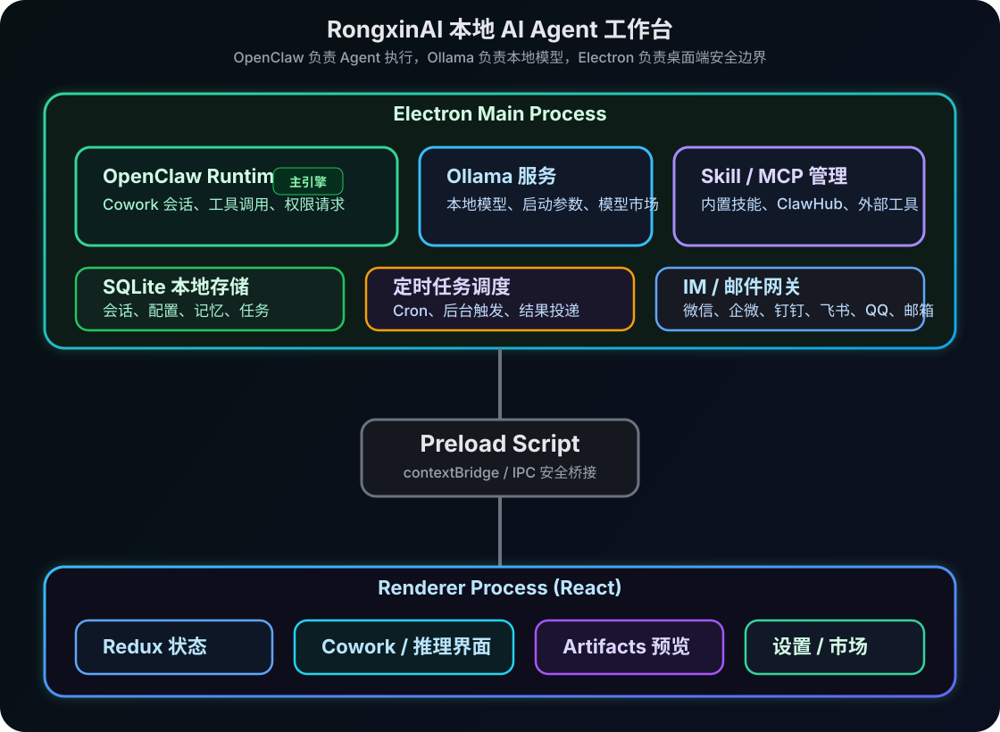

# RongxinAI

<p align="center">
  
</p>

<p align="center">
  <strong>基于 OpenClaw 与 llama.cpp 的本地 AI Agent 工作台</strong>
</p>

<p align="center">
  <a href="LICENSE"></a>
  <br>
  
  <br>
  
  
</p>

<p align="center">
  <a href="README.md">English</a> · 中文
</p>

---

RongxinAI 是一个本地优先的桌面 AI Agent 工作台。它将 **OpenClaw Agent runtime**、**llama.cpp 本地模型推理**、技能系统、MCP 扩展、定时任务和 IM/邮件触达整合到同一个应用中，面向办公自动化、数据分析、文档生成、信息检索和个人助理场景。

项目目标不是做一个单纯聊天客户端，而是提供一个可以在本机执行任务、管理工具权限、调度长期任务、接入本地模型并可通过移动端触发的 Agent 工作环境。

## 核心能力

- **OpenClaw Agent 工作流**：通过 Cowork 会话执行文件操作、命令运行、网页访问、文档处理等任务。
- **llama.cpp 本地推理**：管理本地 GGUF 模型、安装与加载模型、配置启动参数，并把本地模型接入 OpenClaw。
- **技能系统**：内置文档、表格、PPT、PDF、Web 搜索、网页自动化、视频生成、投研、邮件等技能。
- **MCP 扩展**：支持配置 MCP Server，把外部工具和数据源接入 Agent。
- **定时任务**：支持自然语言或 GUI 创建周期任务，例如每日简报、邮箱整理、定期报告。
- **IM/邮件触达**：支持微信、企业微信、钉钉、飞书、QQ、邮箱。
- **权限门控**：涉及文件、终端、网络等敏感工具调用时，需要用户审批。
- **本地数据存储**：会话、配置、记忆和任务元数据保存在本地 SQLite 中。
- **跨平台桌面端**：支持 macOS、Windows、Linux；Windows 包可内置 Python runtime。

## 工作原理

<p align="center">
  
</p>

RongxinAI 使用 Electron 严格进程隔离架构。Renderer 负责 React UI，Preload 通过 `contextBridge` 暴露受控 IPC，Main Process 负责本地存储、OpenClaw runtime 生命周期、llama.cpp 服务管理、技能/MCP/IM 调度。

## 快速开始

### 环境要求

- Node.js `>=24 <25`
- npm

### 本地开发

```bash
git clone https://github.com/rongxinzy/RongxinAI.git RongxinAI
cd RongxinAI
npm install
npm run electron:dev
```

开发服务器默认运行在 `http://localhost:5175`。

### 使用 OpenClaw runtime 开发

```bash
npm run electron:dev:openclaw
```

该命令会按 `package.json` 中的 `openclaw.version` 拉取或切换 OpenClaw 源码，构建并启动内置 runtime。默认源码路径为 `../openclaw`，可通过环境变量覆盖：

```bash
OPENCLAW_SRC=/path/to/openclaw npm run electron:dev:openclaw
```

常用 OpenClaw 构建变量：

| 变量 | 说明 |
|------|------|
| `OPENCLAW_SRC` | 指定 OpenClaw 源码目录 |
| `OPENCLAW_FORCE_BUILD=1` | 强制重新构建 runtime |
| `OPENCLAW_SKIP_ENSURE=1` | 跳过自动切换 OpenClaw 版本，便于本地调试 |

## 构建与打包

```bash
# 类型检查 + Vite 构建
npm run build

# ESLint 检查
npm run lint

# 构建当前平台 OpenClaw runtime
npm run openclaw:runtime:host
```

平台打包：

```bash
npm run dist:mac
npm run dist:win
npm run dist:linux
```

桌面端安装包会把预构建 OpenClaw runtime 放入应用资源目录。Windows 打包流程还会准备便携 Python runtime，用于运行部分 Python 技能；第三方 Python 包按技能需要在运行时安装。

## 主要模块

### Cowork

Cowork 是 RongxinAI 的核心会话系统。用户发起任务后，Renderer 通过 IPC 请求 Main Process，Main Process 将任务交给 OpenClaw runtime。执行过程中的消息、工具调用、权限请求和完成状态会以流式事件返回 UI。

支持的关键事件：

| 事件 | 说明 |
|------|------|
| `message` | 新消息进入会话 |
| `messageUpdate` | 流式内容增量更新 |
| `permissionRequest` | 工具调用需要审批 |
| `complete` | 会话执行完成 |
| `error` | 会话执行失败 |

### llama.cpp 本地推理

本地推理页面用于管理 llama.cpp 服务、本地 GGUF 模型、模型市场和模型启动参数。模型级参数覆盖运行时启动与请求行为，例如上下文长度、GPU offload 层数、线程数、批处理大小、主 GPU、内存映射和驻留时间。服务级参数作用于受应用管理的 `llama-server` 进程，并在启动或重启 llama.cpp 服务后生效。

### 技能与 MCP

`SKILLs/` 目录包含内置技能定义，`SKILLs/skills.config.json` 控制默认启停和排序。技能市场用于发现和安装远端技能；MCP 配置用于接入外部工具服务，例如 GitHub、浏览器、文件系统、数据库或企业内部服务。

常见内置技能包括：

| 技能 | 用途 |
|------|------|
| `web-search` | 搜索与资料收集 |
| `docx` / `xlsx` / `pptx` / `pdf` | Office 与文档处理 |
| `playwright` | 浏览器自动化 |
| `remotion` | 视频生成 |
| `imap-smtp-email` | 邮件收发 |
| `stock-*` | 投研与公告检索 |
| `skill-creator` | 创建自定义技能 |

### 定时任务

定时任务支持自然语言创建和 GUI 配置。任务触发后会启动 Cowork 会话执行，并将结果保留在桌面端；如配置了通知渠道，也可以推送到对应 IM/邮件通道。

### IM 与邮件

当前对外文档只描述产品需要开放和维护的接入方式：

| 通道 | 说明 |
|------|------|
| 微信 | 个人微信账号接入，支持私聊与群聊触发 |
| 企业微信 | 企业微信机器人/应用接入 |
| 钉钉 | 企业机器人接入 |
| 飞书 | 飞书/Lark 应用机器人接入 |
| QQ | QQ 机器人接入 |
| 邮箱 | 通过邮件收发触发 Agent |

## 数据与安全

- 应用配置、会话、消息、Agent、MCP、IM 配置和定时任务元数据存储在本地 SQLite。
- Electron 启用 `contextIsolation`，关闭 Renderer 的 Node 集成。
- Renderer 与 Main 之间只通过显式 IPC 接口通信。
- 高风险工具调用需要用户确认。
- Artifact 预览使用 iframe/DOMPurify/Mermaid strict mode 等隔离与清洗策略。

## 技术栈

| 层 | 技术 |
|----|------|
| 桌面框架 | Electron 40 |
| 前端 | React 18 + TypeScript |
| 构建 | Vite 5 |
| 样式 | Tailwind CSS |
| 状态管理 | Redux Toolkit |
| Agent runtime | OpenClaw |
| 本地模型 | llama.cpp |
| 存储 | better-sqlite3 |
| 文档渲染 | react-markdown / Mermaid / KaTeX |

## OpenClaw 版本

OpenClaw 版本固定在 `package.json`：

```json
{
  "openclaw": {
    "version": "v2026.4.14",
    "repo": "https://github.com/openclaw/openclaw.git"
  }
}
```

升级时修改 `openclaw.version`，然后重新执行 `npm run electron:dev:openclaw` 或对应平台的 runtime 构建命令。

## License

[MIT License](LICENSE)
