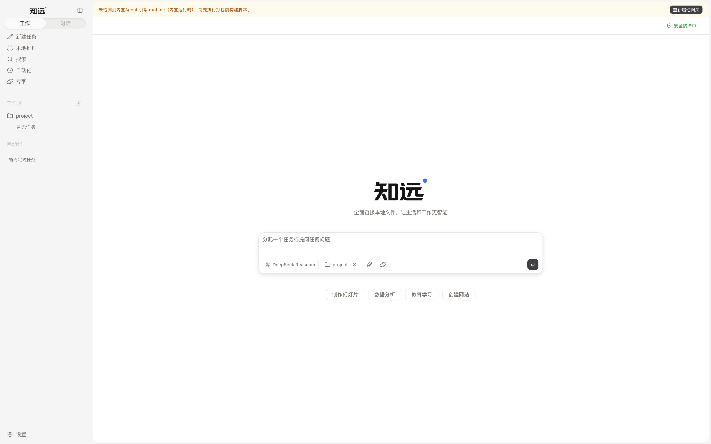
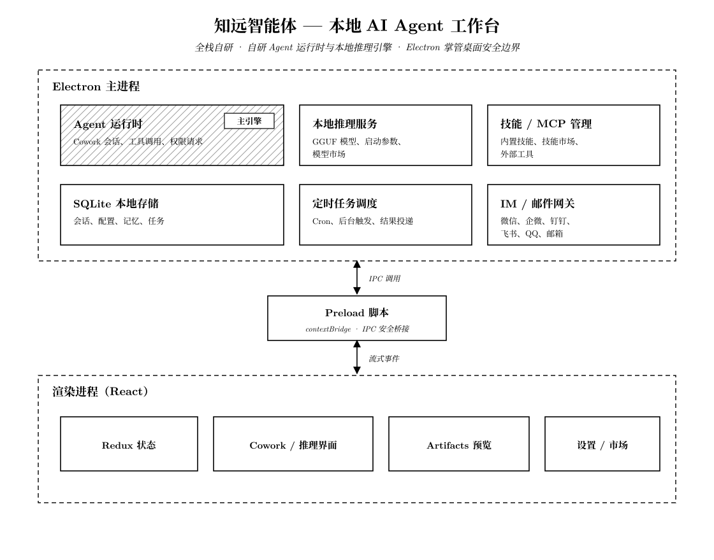

# 知远智能体 — 开源、本地优先的桌面 AI Agent

<p align="center">
  <picture>
    <source media="(prefers-color-scheme: dark)" srcset="public/zhiyuan-logo-dark-1600.png">
    
  </picture>
</p>

<p align="center">
  <strong>能读写文件、运行终端、操作浏览器、调用技能与 MCP，也能使用本地模型的桌面智能体。</strong>
</p>

<p align="center">
  <a href="https://github.com/rongxinzy/RongxinAI/stargazers"></a>
  <a href="LICENSE"></a>
  
</p>

<p align="center">
  <a href="https://www.rongxzyai.com/">官网与下载</a> ·
  <a href="#开发者快速开始">快速开始</a> ·
  <a href="#知远智能体如何工作">技术架构</a> ·
  <a href="README.md">English</a>
</p>

<p align="center">
  
</p>

知远智能体是北京容芯致远推出的开源、本地优先桌面 AI Agent，面向开发、研究、自动化和日常知识工作。它不是又一个聊天套壳：Agent 可以在你的电脑上执行多步骤任务，持续展示过程，并在敏感操作前停下来等待批准。

知远的 Agent 运行时与 GGUF 本地推理引擎均为自研；桌面端把执行环境、本地模型、42 个内置技能、MCP 接入、定时任务以及 IM/邮件触达整合在一个工作台里。

## 为什么选择能执行的本地优先 AI Agent

| 你的需求                 | 知远的处理方式                                                    |
| ------------------------ | ----------------------------------------------------------------- |
| 不只给建议，而是完成工作 | 读写文件、运行终端、操作浏览器并制作文档                          |
| 敏感操作仍由人控制       | 展示工具状态，高风险操作按次请求批准                              |
| 需要本地模型与隐私空间   | 安装并运行 GGUF 模型，可调上下文、GPU offload、线程与服务生命周期 |
| 把经验变成可复用流程     | 组合 42 个内置技能、自定义技能、MCP 服务与定时任务                |
| 离开电脑也能收到结果     | 通过微信、企微、钉钉、飞书/Lark、QQ 或邮件投递结果                |

典型场景包括代码仓库调研、文档与表格处理、浏览器操作、周期简报、收件箱清理、本地模型实验和企业内部工具自动化。

## 下载知远智能体

当前稳定安装包可从[官方下载页](https://www.rongxzyai.com/#download)获取：

- Windows 10/11 x64（Lite 安装包）
- macOS Apple Silicon
- Linux 可从源码构建

想知道安装包执行了什么、在线升级如何保护？可以直接检查 GitHub 上的[发布工作流](.github/workflows/online-update-release.yml)与[在线升级设计](https://github.com/rongxinzy/zhiyuanBackend/blob/main/docs/online-update-design.md)。

## 关注项目进展

如果知远已经帮你把真实工作向前推进，欢迎[给项目一个 Star](https://github.com/rongxinzy/RongxinAI)。你可以及时看到新版本，也能让更多人发现一个源码可检查、权限可控制的开源桌面 AI Agent。

<p align="center">
  <a href="https://github.com/rongxinzy/RongxinAI">
    
  </a>
</p>

## 核心能力

- **Cowork Agent 工作流**：执行多步骤任务，覆盖文件操作、终端命令、浏览器自动化、文档处理和审批门控操作。
- **GGUF 本地推理**：管理模型、调优推理服务参数，并把本地模型接入 Agent 工作流。
- **模型市场**：通过云端目录搜索 ModelScope 上的 GGUF 模型，按任务、设备余量和量化规格给出带证据的星级推荐，并安装到应用管理的模型目录。
- **技能与 MCP**：使用 42 个内置技能、创建自己的技能，并通过 MCP 接入外部工具或企业内部服务。
- **定时任务**：创建简报、跟进、收件箱清理、周期报告等后台任务。
- **IM 与邮件触达**：通过微信、企业微信、钉钉、飞书/Lark、QQ 和邮箱触达 Agent。
- **本地数据与权限控制**：会话、配置和任务元数据保存在本地 SQLite，敏感工具调用需要审批。

## 知远智能体如何工作

<p align="center">
  
</p>

知远使用 Electron 严格进程隔离架构。Renderer 承载 React UI，Preload 通过 `contextBridge` 暴露受控 IPC，Main Process 负责 Agent 会话、本地推理、存储、技能系统、MCP、定时任务和消息网关。

### Cowork Agent 运行时

任务从 Renderer 通过受控 IPC 发送到内置 Agent 运行时。消息、权限请求、工具状态和完成事件会实时流回界面。

| 事件                | 说明             |
| ------------------- | ---------------- |
| `message`           | 会话新增消息     |
| `messageUpdate`     | 流式内容增量更新 |
| `permissionRequest` | 工具调用需要审批 |
| `complete`          | 会话执行完成     |
| `error`             | 会话执行失败     |

### 本地推理与模型市场

本地推理工作台管理应用托管的推理服务、GGUF 模型、基于 ModelScope 的模型市场，以及上下文长度、GPU offload 层数、线程数、批大小、主 GPU、内存映射和 keep-alive 等启动参数。

### 技能、MCP 与自动化

`SKILLs/` 包含内置技能，`SKILLs/skills.config.json` 控制默认启停与排序。MCP 设置用于接入 GitHub、浏览器、数据库、文件系统以及企业内部服务等工具。

定时任务既可以通过自然语言创建，也可以在 GUI 中配置。触发后，知远会启动 Cowork 会话、在桌面端保存结果，并可通过已配置的 IM 或邮件渠道发送通知。

## 开发者快速开始

### 环境要求

- Node.js `>=24 <25`
- Bun `>=1.3`

### 本地运行

```bash
git clone https://github.com/rongxinzy/RongxinAI.git
cd RongxinAI
bun install
bun run electron:dev
```

分别准备运行时：

```bash
# 下载当前主机对应的 llama.cpp 运行时
bun run llamacpp:runtime:download

# 下载当前主机对应的记忆运行时
bun run engram:runtime:host
```

### 构建、测试与打包

```bash
bun run build              # TypeScript 类型检查 + Vite 生产构建
bun run lint               # oxlint
bun run format:check       # oxfmt
bun test                   # Vitest
bun run compile:electron   # 仅编译 Electron 主进程

bun run dist:mac
bun run dist:win
bun run dist:linux
```

## 技术栈

| 层           | 技术                           |
| ------------ | ------------------------------ |
| 桌面框架     | Electron 40                    |
| 前端         | React 19 + TypeScript 7        |
| 构建         | Vite 8（Rolldown）             |
| 样式         | Tailwind CSS 4                 |
| 工具链       | Bun、oxlint、oxfmt             |
| 状态管理     | Redux Toolkit                  |
| Agent 运行时 | 自研                           |
| 本地推理     | 自研、兼容 GGUF 模型           |
| 存储         | better-sqlite3                 |
| 渲染         | react-markdown、Mermaid、KaTeX |

## 社区与贡献

- 发现问题或有新想法，可以[提交 Issue](https://github.com/rongxinzy/RongxinAI/issues)。
- 想交流工作流、使用经验和社区提案，可以提交标题清晰的[功能提案](https://github.com/rongxinzy/RongxinAI/issues)。
- 修改代码前请先阅读 [`AGENTS.md`](AGENTS.md)，然后提交 Pull Request。

## License

[GNU Affero General Public License v3.0](LICENSE)

## 赞助

感谢 [AnySearch](https://www.anysearch.com/) 对内置联网搜索能力的支持。离开仓库访问赞助方之前，也可以先查看 [`SKILLs/web-search`](SKILLs/web-search) 里的实现。
