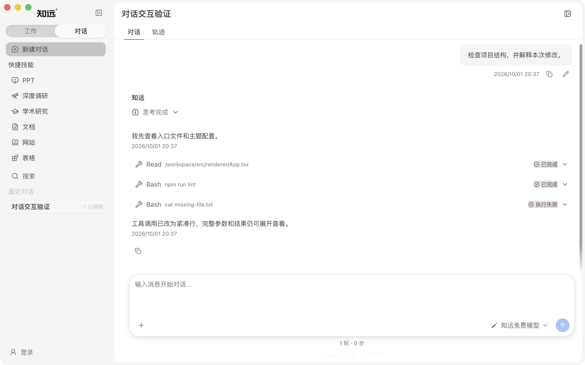
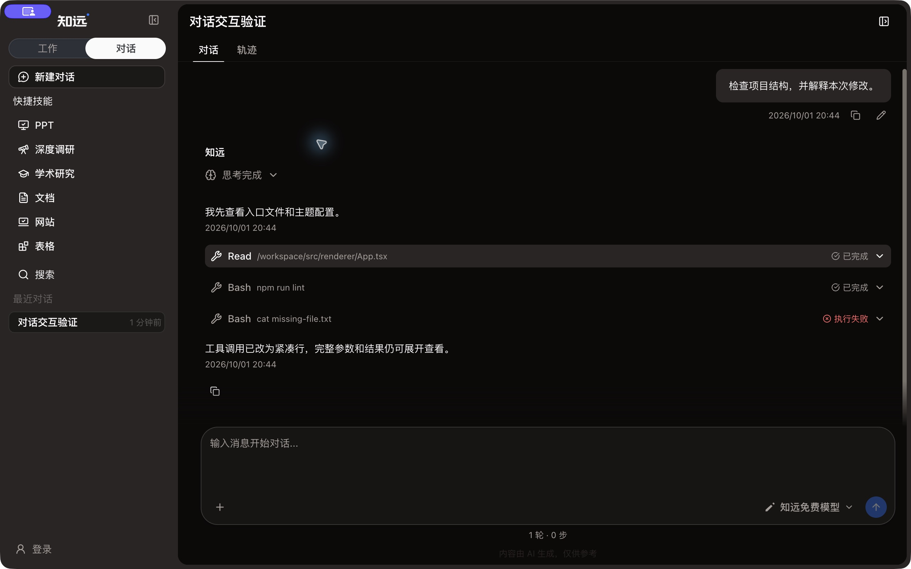
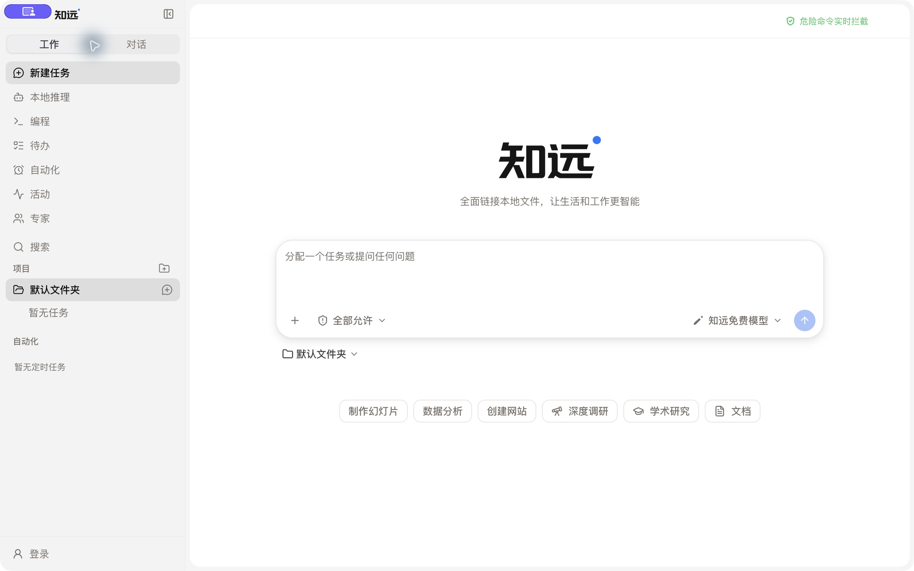
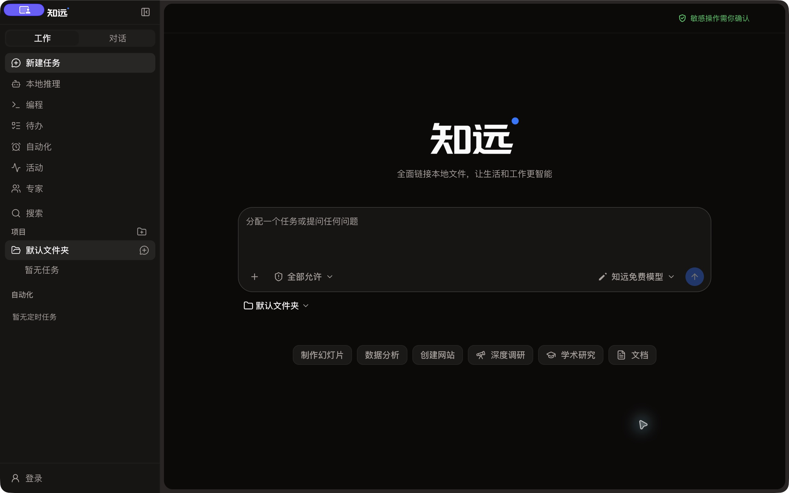

# MonoCode-inspired chat and sidebar verification

These captures use a clean Electron development profile and synthetic conversation data. They contain no real user conversations or model credentials.

## Chat activity

Tool calls render as compact rows, preserve message order, and disclose parameters and output in the same expansion. Reasoning, failures, artifact preview controls, permission actions, and export expansion use shared AI Elements and shadcn primitives.

These chat captures were taken before the final sidebar restyle; use the sidebar captures below to review the final shell appearance.

| Light | Dark |
| --- | --- |
|  |  |

## Final sidebar

Default width is 260px; the header is 40px and navigation, workspace, and conversation rows are 32px. Labels, neutral hover/selection surfaces, static lucide icons, a compact work/chat switch, and short feedback transitions are owned by theme recipes.

| Light | Dark |
| --- | --- |
|  |  |

## Validation

- Electron UI: work/chat switching, search focus and Escape restoration, keyboard row/menu access, project expansion, sidebar collapse/reopen, resizing from 260px to 340px and back, long-title overflow, light/dark appearance, and reduced motion.
- Theme hot switch: a changed navigation recipe takes effect without replacing the editor, losing its draft or focus, changing the selected session or scroll position, or closing an open menu.
- PR branch based on current main: 280 renderer/shared test files, 1542 tests; lint and theme audit; repository-wide formatting check; production build and renderer bundle budget.
- The desktop interaction captures precede rebasing onto current main. Integration with main retains its user-image fix and is covered by the final branch's tests/build.
- No live model turn, real tool-permission IPC round trip, or packaged installer acceptance was run for this presentation change.

Reference: [MonoCode](https://github.com/hardbeat920/monocode/tree/a67e614fbed50524f2f8ea03d825fbdc43de1a1d). This change adopts its interaction and visual organization through existing project components and theme contracts.
