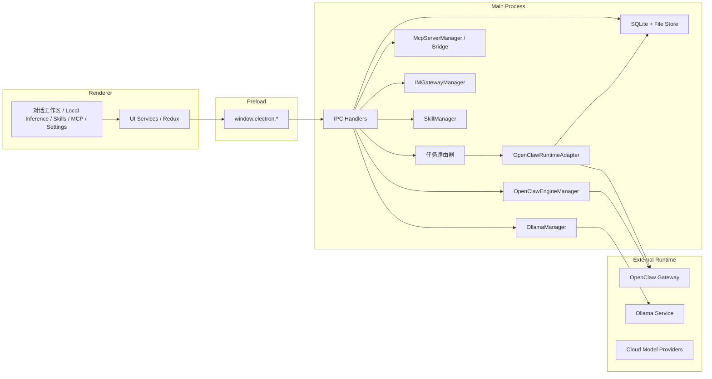

# RongxinAI 产品白皮书

> **版本**：V2.0  
> **定位**：桌面端 AI 工作台与任务执行平台  
> **依据**：当前 `main` 分支源码

## 1. 产品定位

RongxinAI 是一款基于 Electron 的本地优先 AI 工作台。它不是单纯的聊天应用，而是把对话、任务执行、本地推理、技能扩展、MCP 工具接入、IM 机器人和定时任务整合为一个统一工作面。

产品的核心目标有三个：

1. 让用户在一个界面里完成多种 AI 协作任务
2. 让任务执行过程可追踪、可停止、可恢复
3. 让本地数据、本地模型和外部工具之间的边界清晰可控

## 2. 典型使用人群

- 开发者：代码生成、调试、文档生成、自动化验证
- 运营和产品人员：报告整理、内容生成、任务推送
- 团队管理员：IM 机器人、定时任务、工具接入
- 本地部署用户：离线推理、数据隔离、私有环境使用

## 3. 产品组成

RongxinAI 的实现可分为五个部分：

### 3.1 Renderer

负责界面和交互，包括：

- 对话工作区页面
- 本地推理页面
- Skills 页面
- MCP 页面
- Scheduled Tasks 页面
- Settings 页面

### 3.2 Preload

通过 `contextBridge` 暴露受控的 `window.electron.*` API，让渲染进程只能通过 IPC 调用主进程能力。

### 3.3 Main Process

负责系统能力、存储、引擎管理和外部服务调用，包括：

- SQLite 持久化
- 对话会话和消息管理
- OpenClaw 引擎管理
- Ollama 服务管理
- IM 网关管理
- Skills 与 MCP 管理
- 应用更新、日志导出、窗口生命周期

### 3.4 本地存储

主要使用 SQLite 和文件系统保存：

- 应用配置
- 对话会话
- 消息记录
- 技能和 MCP 配置
- 本地模型和运行状态

### 3.5 外部运行时

- `OpenClaw`：执行引擎
- `Ollama`：本地模型推理引擎
- 第三方 API 提供商：云端模型能力

## 4. 关键能力

### 4.1 对话工作区与任务执行

对话工作区是产品的核心任务层。用户在这里发起任务，系统负责把任务交给对应引擎执行，并将消息、工具调用、错误和完成状态回传给界面。

特点包括：

- 流式输出
- 权限请求
- 消息历史保存
- 会话继续与重放
- 引擎可切换

### 4.2 OpenClaw 运行时

OpenClaw 是执行引擎之一。它负责把模型推理、工具调用、会话同步和外部交互组织成可运行的 agent 流程。

其设计重点是：

- 用统一事件抽象业务结果
- 把引擎生命周期和业务会话分离
- 让前端不直接依赖引擎内部实现

### 4.3 Ollama 本地推理

Ollama 用于本地模型管理和推理。它支持：

- 检测本地安装
- 安装和启动服务
- 拉取模型
- 加载与卸载模型
- 删除模型
- 直接推理调试
- 设为 OpenClaw 默认模型

这条能力线适合高隐私、低延迟和离线可用场景。

Ollama 的配置分为三层：

- 服务参数：控制 `ollama serve` 的运行方式，例如 GPU 可见性、并发数和常驻模型数
- 模型启动参数：控制单个模型的加载方式，例如上下文长度、GPU 层数和线程数
- 推理参数：控制每次回答的采样行为，例如 `temperature`、`top_p`、`top_k` 和 `num_predict`

服务参数通常需要重启服务后生效，模型启动参数在重新加载模型时生效，推理参数则作用于当前请求。

### 4.4 技能系统

技能是模型能力的扩展层。它的作用不是替代模型，而是给模型加上领域知识和工具能力。

技能的主要用途包括：

- 文档生成
- 表格处理
- 演示文稿制作
- 浏览器自动化
- 网络检索
- 自定义能力扩展

### 4.5 MCP 接入

MCP 是外部工具接入层。RongxinAI 通过 MCP 管理器和桥接服务把外部工具注册到系统中，供对话工作区或相关模块调用。

MCP 的价值在于：

- 统一工具协议
- 降低外部工具接入成本
- 让工具可配置、可启停、可维护

### 4.6 定时任务与 IM

定时任务用于把 AI 从“被动响应”变成“主动执行”。IM 集成用于把任务执行能力延伸到实际聊天渠道。

这两者组合后，可以支持：

- 定时汇报
- 自动提醒
- 群聊答复
- 任务自动投递

## 5. 系统架构

## 6. 数据流

### 6.1 对话会话流

1. 用户在界面发起任务
2. 渲染进程通过 IPC 请求主进程
3. 主进程写入会话和消息
4. 任务被路由到 OpenClaw 或其他兼容执行层
5. 引擎通过流式事件回传消息、工具请求和完成结果
6. 主进程同步写回数据库

### 6.2 本地推理流

1. 用户在 Local Inference 页面选择模型
2. 主进程调用 Ollama 管理器
3. 模型拉取、加载、卸载或推理都通过 IPC 完成
4. 结果按流式 chunk 返回到界面
5. 推理结束后保存到前端状态或本地配置

### 6.3 MCP 与 IM 流

1. 用户在对应页面配置工具或消息渠道
2. 主进程写入配置并更新桥接
3. OpenClaw 或对话工作区在运行时使用这些工具
4. 工具输出或消息结果再回传到界面或外部平台

## 7. 存储与安全

### 7.1 本地优先

应用的配置、任务和消息保存在本地数据库和文件系统中。这样做的好处是：

- 可离线运行部分能力
- 降低云端依赖
- 便于审计和迁移

### 7.2 进程隔离

渲染进程不直接接触系统 API。主进程通过受控 IPC 暴露能力，这样可以降低界面层误操作对系统的影响。

### 7.3 外部能力边界

云模型、MCP 工具和 IM 平台都属于外部边界。产品的设计原则是：

- 配置显式化
- 权限可见
- 引擎状态可感知
- 失败时可回退或提示

## 8. 典型场景

### 8.1 代码协作

适合开发者在对话工作区中完成：

- 需求分析
- 代码编写
- 重构说明
- 调试记录

### 8.2 本地模型验证

适合在 Ollama 页面完成：

- 模型安装
- 启动参数调整
- 输出质量对比
- OpenClaw 默认模型绑定

### 8.3 任务自动化

适合使用定时任务和 IM：

- 定时汇总
- 每日报告
- 自动提醒
- 群聊答复

### 8.4 工具扩展

适合通过 MCP 和技能扩展：

- 接入外部 API
- 封装重复流程
- 增加专业知识域

## 9. 产品特性总结

- 统一工作台，而不是分散工具拼接
- 对话工作区负责任务层，OpenClaw 负责执行层
- Ollama 负责本地推理，支持离线使用
- 技能、MCP、IM、定时任务共同构成扩展面
- 所有关键配置都可通过界面完成
- 数据和运行边界清晰，适合持续维护

## 10. 结语

RongxinAI 的产品方向不是把“聊天”做得更花哨，而是把 AI 变成可以持续工作、可管理、可集成的桌面工作台。

如果需要后续继续扩写，这份白皮书可以进一步补充：

- 部署与升级说明
- 版本演进与兼容策略
- 企业版安全策略
- 运行监控与故障排查
