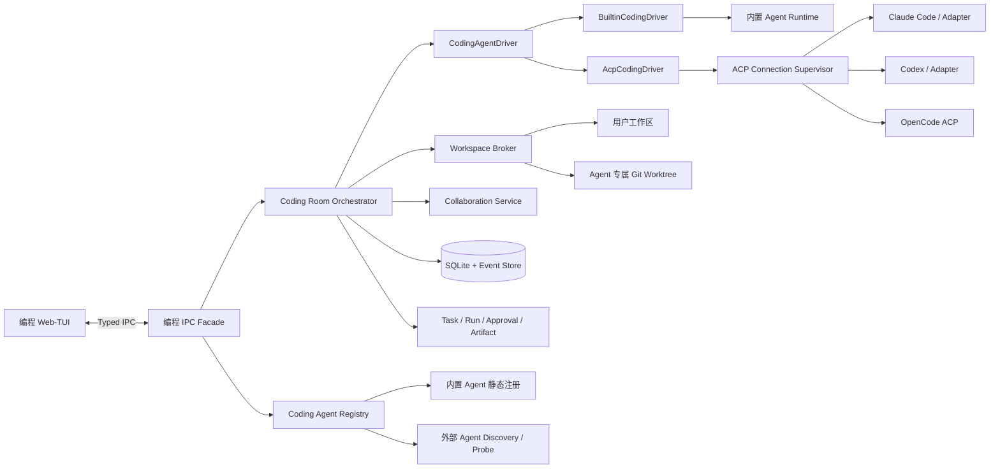
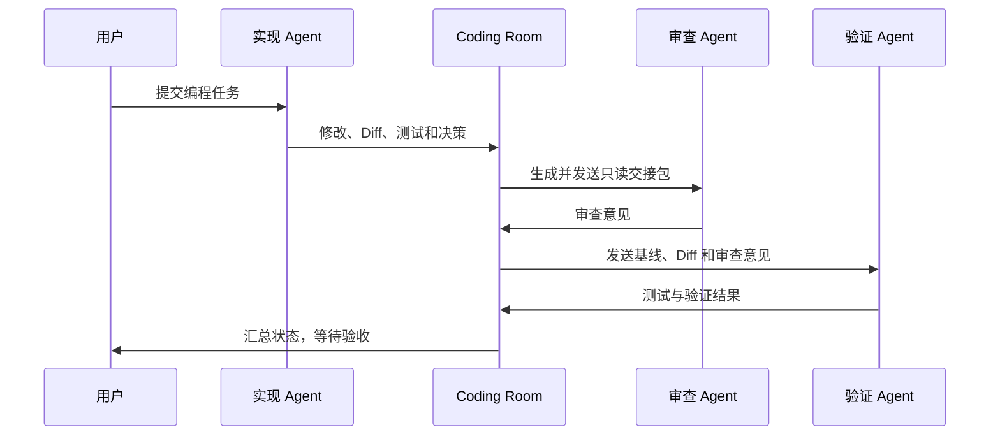

# ACP 编程模式设计

> 状态：工程实现完成，待真实 ACP 互操作验收
>
> 最后更新：2026-08-26
>
> 产品名称：知远智能体
>
> 入口：工作模式 → 编程

## 1. 文档目的

本文档定义知远智能体“编程”模式的产品边界、底层架构、Agent 发现与接入、多 Agent 协作、工作区安全、数据模型、UI 草图、实施阶段和验收标准。

后续实现应以本文档为基线。若实现过程中需要改变本文档中的协议边界、任务模型、写入隔离或交互语义，应先更新设计并重新评审，不应直接在代码中形成隐式新方案。

## 2. 一句话定义

“编程”是知远智能体内置的统一编程工作台：用户即使没有安装任何外部编程 Agent，也能使用内置的知远编程 Agent 完成任务；安装了 Claude Code、Codex、OpenCode 等 Agent 后，知远通过 ACP 发现、连接并组织它们协作，但不接管或注入这些 Agent 的模型与账号。

## 3. 已确认决策

### 3.1 产品入口

- 保留现有顶部“工作 / 对话”切换。
- “编程”是工作模式下的独立导航入口。
- 进入后，右侧主区域完整切换为独立的编程 Web-TUI。
- 编程模式不作为 Cowork 对话中的 Artifact，也不嵌入 CLI TUI WebView。
- 切入和切出编程模式不应销毁原有工作、对话或 ACP 会话。

### 3.2 Agent 边界

- 内置知远编程 Agent 永远是第一方、一等能力。
- 外部 Agent 是可选增强项，不是使用编程模式的前置条件。
- 外部 Agent 通过 ACP 接入。
- 知远不向外部 Agent 注入自己的 API Key、Provider URL、模型名称、系统提示词或内置运行时配置。
- 每个外部 Agent 保留自己的账号、模型、配置、工具和记忆。
- 知远只使用 Agent 通过 ACP 明确声明的能力。

### 3.3 多 Agent 边界

- ACP 解决的是 Client 与 Agent 之间的连接，不直接定义 Agent 与 Agent 的协作协议。
- 多 Agent 协作由知远的 Coding Room Orchestrator 组织。
- 每个 Agent 拥有独立的连接、会话、状态、事件流和权限上下文。
- Agent 之间通过显式交接包协作，不共享隐式可变上下文。
- 第一版核心流程不得依赖私有 ACP 方法。

### 3.4 用户可见命名

- UI 显示“知远编程 Agent”，不显示内部运行时名称。
- ACP、运行时、适配器等实现细节只在诊断或开发文档中出现。
- 外部 Agent 使用其公开产品名称，例如 Claude Code、Codex、OpenCode。

## 4. 现有系统约束

当前代码中，`WorkMode` 只承载工作和对话两种 Cowork 执行语义：

- [`src/renderer/store/workMode/constants.ts`](../../src/renderer/store/workMode/constants.ts)
- [`src/renderer/components/cowork/CoworkView.tsx`](../../src/renderer/components/cowork/CoworkView.tsx)

`CoworkView` 会根据 WorkMode 清理不匹配的当前会话。因此不应把 `coding` 加入现有 `WorkMode`，否则会把编程导航与 Cowork 会话清理语义错误耦合。

推荐做法：

- Work/Chat 保持原样。
- 在工作导航下添加“编程”。
- 编程对应独立的 `MainView.Coding`。
- `App.tsx` 只做最小视图路由。
- 新业务逻辑全部放入独立模块。

相关入口：

- [`src/renderer/components/SidebarNavigationControls.tsx`](../../src/renderer/components/SidebarNavigationControls.tsx)
- [`src/renderer/components/Sidebar.tsx`](../../src/renderer/components/Sidebar.tsx)
- [`src/renderer/App.tsx`](../../src/renderer/App.tsx)

现有 Workbench Task 已定义 Task、Run、Approval 和 Artifact，可以复用其领域语义，但当前主进程中的部分恢复和验证路径仍然直接依赖 Cowork/Pi 会话，接入 ACP 前需要增加运行时路由层：

- [`src/shared/workbenchTask/constants.ts`](../../src/shared/workbenchTask/constants.ts)
- [`src/shared/workbenchTask/types.ts`](../../src/shared/workbenchTask/types.ts)
- [`src/main/workbenchTask/taskService.ts`](../../src/main/workbenchTask/taskService.ts)

## 5. 总体架构



### 5.1 为什么不让内置运行时通过 ACP 自连接

ACP 是外部 Agent 的稳定集成边界，不必强制成为知远内部所有调用的唯一协议。

让内置运行时先实现 ACP Server，再由应用启动 ACP Client 连接自身，会带来额外的序列化、子进程生命周期、认证和错误恢复成本，却不增加用户价值。

正确的统一点是应用内部的 `CodingAgentDriver`：

```text
CodingAgentDriver
├── BuiltinCodingDriver
│   └── 直接调用现有内置 Agent Runtime
└── AcpCodingDriver
    └── 通过 ACP SDK 连接外部 Agent
```

如果未来需要让第三方编辑器连接知远编程 Agent，可以另行提供 ACP Server Adapter，但这不属于第一阶段。

## 6. CodingAgentDriver

### 6.1 职责

`CodingAgentDriver` 是编程工作台与具体 Agent 实现之间的内部边界，负责：

- 报告能力和认证状态。
- 创建、加载或恢复会话。
- 发送用户 Prompt。
- 接收规范化事件。
- 取消当前轮次。
- 响应权限请求。
- 释放会话和运行时资源。

概念接口：

```ts
interface CodingAgentDriver {
  getCapabilities(): Promise<CodingAgentCapabilities>;
  getAuthState(): Promise<CodingAgentAuthState>;
  authenticate(request: CodingAgentAuthRequest): Promise<void>;
  createSession(request: CreateCodingSessionRequest): Promise<CodingAgentSession>;
  loadSession(request: LoadCodingSessionRequest): Promise<CodingAgentSession>;
  prompt(request: CodingPromptRequest): AsyncIterable<CodingAgentEvent>;
  cancel(request: CancelCodingTurnRequest): Promise<void>;
  respondToPermission(response: CodingPermissionResponse): Promise<void>;
  disposeSession(sessionId: string): Promise<void>;
  dispose(): Promise<void>;
}
```

实现时，所有会重复比较的 kind、status、IPC channel 和 mode 必须定义在模块级 `constants.ts` 中，不能散落裸字符串。

### 6.2 统一事件

Driver 需要把内置运行时事件与 ACP `session/update` 归一化为统一领域事件：

- 消息与增量消息。
- 推理或状态说明。
- Agent Plan。
- Tool Call 及状态变化。
- 权限请求及处理结果。
- 文件读取、修改和 Diff。
- 终端命令及输出。
- Usage。
- Turn 完成、取消或失败。

Renderer 只消费统一事件，不直接理解 Pi 事件或原始 ACP JSON-RPC。

### 6.3 能力矩阵

每个 Agent Profile 保存实际探测到的能力：

```text
supportsLoadSession
supportsResumeSession
supportsPlans
supportsPermissions
supportsFilesystem
supportsTerminal
supportsConfigOptions
supportsUsage
supportsElicitation
```

UI 必须按能力渐进增强：

- Agent 支持配置选项时，动态渲染其模型、模式或推理选项。
- Agent 不支持会话恢复时，提供“新建会话并发送交接摘要”。
- Agent 不支持计划时，不显示空计划面板。
- 知远不能硬编码某个外部 Agent 一定支持某项能力。

## 7. 内置知远编程 Agent

### 7.1 定位

知远编程 Agent 是默认 Agent，而不是外部 Agent 不可用时才出现的降级入口。

它必须支持：

- 独立完成编程任务。
- 读取和修改工作区文件。
- 执行命令和测试。
- 请求工具权限。
- 生成 Diff 和 Artifact。
- 作为多 Agent 任务的主 Agent、实现 Agent、修复 Agent 或验证 Agent。

### 7.2 可用性

- 不要求用户安装 Claude Code、Codex、OpenCode 或 ACP Adapter。
- 用户已配置可用模型时，可以直接开始任务。
- 如果知远本身尚未配置任何可用模型，菜单仍显示内置 Agent，但状态为“需要配置模型”，并引导用户完成知远自身配置。
- 外部 Agent 的认证状态不得影响内置 Agent。

### 7.3 配置边界

- 内置 Agent 使用知远现有模型、权限、Skills、MCP 和本地推理配置。
- 这些配置不复制给外部 Agent。
- 外部 Agent 只使用自己的账号、模型、工具和 ACP Config Options。

## 8. 外部 ACP Agent

### 8.1 ACP 映射

| ACP 能力 | 知远内部对象 |
| --- | --- |
| `initialize` | Agent Profile、协议和能力快照 |
| `authenticate` | Agent 认证流程 |
| `session/new` | 新 Agent Lane 会话 |
| `session/load` / `session/resume` | 会话恢复 |
| `session/prompt` | Assignment Run 中的一轮执行 |
| `session/update` | 规范化事件流 |
| Agent Plan | 计划展示 |
| Tool Call / Diff | Tool Event、Changes、Artifact |
| Permission Request | 持久化 Approval |
| `fs/*` | Workspace Broker |
| `terminal/*` | Terminal Broker |
| `session/cancel` | 取消当前轮次 |
| `stopReason` | Run 的轮次结束信号，不代表 Mission 完成 |

协议参考：

- [ACP Introduction](https://agentclientprotocol.com/get-started/introduction)
- [ACP Protocol Overview](https://agentclientprotocol.com/protocol/v1/overview)
- [ACP Architecture](https://agentclientprotocol.com/get-started/architecture)
- [ACP Initialization](https://agentclientprotocol.com/protocol/v1/initialization)
- [ACP Session Setup](https://agentclientprotocol.com/protocol/v1/session-setup)
- [ACP Prompt Turn](https://agentclientprotocol.com/protocol/v1/prompt-turn)
- [ACP Tool Calls](https://agentclientprotocol.com/protocol/v1/tool-calls)
- [ACP Authentication](https://agentclientprotocol.com/protocol/v1/authentication)
- [ACP TypeScript SDK](https://agentclientprotocol.com/libraries/typescript)

### 8.2 传输

第一版只支持当前稳定的本地 stdio 传输：

- 知远按需启动外部 Agent 或 Adapter 子进程。
- stdin/stdout 承载换行分隔的 UTF-8 JSON-RPC。
- stderr 只用于诊断日志，绝不进入协议解析。
- 使用精确 executable 和 argv，禁止通过拼接 shell 字符串启动。
- 远程 HTTP/WebSocket 传输待 ACP 相应规范稳定后再评估。

### 8.3 Connection Supervisor

`AcpConnectionSupervisor` 负责：

- 子进程启动和退出。
- 请求 ID 与 pending request。
- JSON 分片、粘包、非法消息和超时。
- 协议初始化和能力协商。
- stderr 诊断流。
- 崩溃检测和有限重启。
- App 退出时的资源释放。

一个 Agent Profile 的连接可以承载多个 ACP Session。每个 Session 必须有知远本地 ID 与远端 opaque session ID 的映射。

## 9. Agent 发现与管理

### 9.1 内置 Agent

内置 Agent 由应用静态注册：

- 永远出现在 Agent Picker 第一组。
- 不参加本机扫描。
- 不依赖 ACP Probe。
- 状态只取决于知远自身模型和运行时是否可用。

### 9.2 外部 Agent 两阶段发现

第一阶段是被动扫描，不启动未知命令：

- `PATH`。
- 已知用户级二进制目录。
- npm、pnpm、Bun、uv 等包管理器安装信息。
- ACP Registry 的发行名称、Adapter 和启动参数元数据。
- 用户显式添加的自定义 Agent 命令。

禁止默认全盘扫描。

第二阶段是显式 Probe：

- 只启动已匹配或用户确认的命令。
- 最多等待约 5 秒完成 `initialize`。
- 记录协议版本、能力、认证方式和会话恢复能力。
- Probe 完成后关闭进程，不发送项目任务。

### 9.3 状态模型

```text
Detected        检测到 Agent，但尚未验证 ACP
Ready           ACP 握手成功，可以使用
NeedsAdapter    Agent 存在，但需要 ACP Adapter
NeedsAuth       ACP 可用，但需要登录
Incompatible    协议或必需能力不兼容
Untrusted       自定义命令，等待用户确认
Unavailable     原来可用，但当前可执行文件已消失或启动失败
```

ACP Registry 只能作为安装和启动元数据来源，不能作为本机已安装的证明。第一版不自动安装 Adapter，只提供明确的管理和安装入口。

## 10. 编程任务领域模型

### 10.1 层级

```text
CodingRoom
└── CodingMission              左侧列表中的一个“编程任务”
    ├── AgentLane × N          每个参与 Agent 的独立会话
    ├── CodingAssignment × N   分配给某个 Agent 的工作单元
    │   └── Workbench Task
    │       └── Run × N
    ├── HandoffPackage × N
    ├── Approval × N
    └── Artifact × N
```

### 10.2 CodingRoom

代表一个逻辑工作区环境，至少保存：

- 工作区根目录。
- 可额外访问的明确目录。
- 当前 Mission。
- 当前 Agent Lane。
- Git 仓库和冻结基线信息。
- 协作和写入隔离策略。

### 10.3 CodingMission

代表用户在左侧任务列表看到的一个完整编程目标，例如“修复登录刷新问题”。

Mission 不直接等于某个 ACP Session，也不应因为某一轮 `stopReason=end_turn` 就自动完成。

### 10.4 AgentLane

每个参与 Agent 一条 Lane，保存：

- Agent Profile ID。
- Driver Kind。
- 本地 Session ID。
- 外部 ACP Session ID（如适用）。
- 当前 Assignment 和 Run。
- Draft、Scroll Position 和事件游标。
- Agent 提供的 Config Options。
- 工作树和 Writer Lease。
- 运行、等待权限、需认证、断开、完成等状态。

切换 Agent 只修改 `activeAgentLaneId`，不得销毁其他 Lane。

### 10.5 CodingAssignment

Mission 中交给单个 Agent 的明确工作单元，例如：

- 实现修复。
- 只读审查 Diff。
- 执行测试并验证。
- 根据审查意见修改。

每个 Assignment 映射到独立 Workbench Task/Run，避免多个 Agent 争用单一 `active_run_id`。

### 10.6 HandoffPackage

Agent 间交接使用不可变交接包：

- Mission 目标和约束。
- Assignment 说明。
- 基线 Git commit。
- 修改文件和 Diff。
- 已运行命令及退出状态。
- 测试结果。
- 已做决策及原因。
- 未解决问题。
- Artifact 和资源引用。
- 来源 Agent、目标 Agent、创建时间。

交接包通过标准 Prompt Content Blocks 发送给下一个 Agent，不依赖私有 ACP 方法。

## 11. 多 Agent 协作

### 11.1 默认行为

- 一个 Mission 初始只有一个主 Agent。
- Composer 默认只向当前选中的 Agent 发送消息。
- 切换 Agent 不自动广播消息或交接上下文。
- 添加协作者和交接都必须是显式用户动作或用户启用的协作预设动作。
- 知远不使用自己的模型在幕后替用户决定哪个外部 Agent 应该做什么；协作编排按确定性规则或用户选择执行。

### 11.2 协作预设

#### 实现 → 审查 → 验证



#### 并行方案评审

- 多个 Agent 从同一冻结基线进行只读分析。
- 各 Agent 独立输出方案。
- 用户选择方案，或指定一个 Agent 接收其他方案并汇总。
- 不允许只读阶段产生工作区写入。

#### 主 Agent + 专项 Agent

- 主 Agent 负责整体实现。
- 专项 Agent 负责测试、安全、性能或文档。
- 专项结果通过 HandoffPackage 返回主 Agent。

### 11.3 内置 Agent 的协作地位

知远编程 Agent 可以承担任何角色：

- 单独完成任务。
- 作为主 Agent 分配审查或验证工作。
- 接收外部 Agent 的实现结果并修复。
- 在外部 Agent 认证失败、断开或崩溃后继续处理。

它不是“外部 Agent 全部失败后的隐藏降级项”，而是 Agent Picker 中始终可见的一等选项。

## 12. 工作区并发与写入隔离

### 12.1 默认 Writer Lease

同一物理工作区默认只有一条 Agent Lane 可以持有写权限：

- 当前 Writer 可以修改文件和执行会写入的命令。
- 其他 Agent 默认只读。
- Writer 切换必须等待当前写操作结束，并产生清晰的 Lease 转移事件。
- 权限弹窗应显示请求 Agent、目标路径、操作和当前 Lease 状态。

### 12.2 Git 并行写入

需要多个 Agent 并行实现时：

- 从同一冻结 Git 基线为每条 Writer Lane 创建应用管理的 Worktree。
- 每个 Agent 只操作自己的 Worktree。
- Changes 面板按 Lane 展示 Diff。
- 合并或应用回用户主工作区必须获得用户确认。
- 冲突进入显式冲突处理 UI，不自动覆盖。

### 12.3 非 Git 工作区

- 不提供并行 Writer。
- 多 Agent 只能串行写入或并行只读。
- 不通过复制整个目录伪造 Worktree。

## 13. 文件系统、终端和认证

### 13.1 Workspace Broker

- 所有路径转换为绝对路径。
- 使用 `realpath` 校验真实目标。
- 目标必须位于工作区根目录或用户明确授权的附加目录。
- 阻止 `../`、符号链接和挂载点逃逸。
- 文件修改记录到事件流、Artifact 和审计信息。

### 13.2 ACP Terminal

ACP `terminal/create` 表示启动非交互命令并返回输出，不等同于 PTY 或完整 CLI TUI。

`TerminalBroker` 负责：

- command、args、env 和 cwd。
- 输出字节限制和截断标记。
- wait、kill 和 release。
- 退出码和信号。
- 与 Tool Call 的关联。

现有 AI Elements Terminal 可以作为输出渲染基础，但不能直接承担认证 PTY。

### 13.3 Auth Terminal

外部 Agent 声明终端认证时，使用独立 `AuthTerminalService`：

- 创建交互式 PTY。
- 只执行 Agent 声明或用户确认的认证命令。
- 认证完成后关闭 PTY。
- 重新启动 ACP 连接并再次初始化。
- 不把 PTY 输出当作 ACP stdout 解析。

## 14. 安全边界

### 14.1 外部进程环境变量

外部 Agent 使用最小化、允许列表式环境：

- 必需的 PATH、Home 和 Locale。
- Agent Profile 明确配置的变量。
- Agent 官方认证所需且用户授权传递的环境。

禁止默认批量继承：

- 知远 Provider Key。
- 知远模型配置。
- 与目标 Agent 无关的云服务凭据。
- 主进程的完整环境变量集合。

日志必须屏蔽认证值和敏感环境变量。

### 14.2 ACP Permission 的真实边界

ACP Permission 只能治理 Agent 通过 ACP Client 请求的操作。如果外部 Agent 自身拥有直接访问本机的工具，ACP 不天然构成强沙箱。

因此产品文案不能宣称“所有外部 Agent 都被完全隔离”。严格隔离属于后续能力，需要结合：

- 系统沙箱。
- 容器或虚拟化。
- 受限工作树。
- 受控环境变量和文件挂载。

### 14.3 能力声明

知远只在真正完成某个 Client Capability 时才向 Agent 声明支持，不能为了通过握手虚假声明文件系统、终端、认证或 Elicitation 能力。

## 15. UI 信息架构

### 15.1 总体布局

参考 Zed 的 Agent Picker 切入方式，但不照搬其编辑器布局。

```text
┌────────────────────────────────────────────────────────────────────────────┐
│ 编程  /workspace/project                         工作区        设置        │
├───────────────────┬────────────────────────────────────┬───────────────────┤
│ 编程任务       ＋ │ 当前任务参与者                       │ Changes / Files   │
│                   │ [知远编程 Agent] [Codex] [＋协作者] │ / Terminal        │
│ 修复登录刷新问题  ├────────────────────────────────────┤                   │
│ 知远 · 运行中     │                                    │ Diff Preview      │
│                   │ 当前 Agent 的结构化事件流            │                   │
│ 审查数据库迁移    │ Message / Plan / Tool / Permission  │                   │
│ Codex · 已完成    │ / Terminal / Handoff                │                   │
│                   │                                    │                   │
│                   ├────────────────────────────────────┤                   │
│                   │ 发给当前 Agent…              发送   │                   │
└───────────────────┴────────────────────────────────────┴───────────────────┘
```

右侧 Inspector 没有内容时可以折叠，为中央事件流释放空间。

### 15.2 Zed 式 Agent Picker

左侧“编程任务”标题旁的 `＋` 用于新建任务：

```text
┌──────────────────────────────┐
│ 内置                         │
│                              │
│ ✦ 知远编程 Agent        可用 │
│   无需安装外部 Agent         │
├──────────────────────────────┤
│ 外部 Agent                   │
│                              │
│ * Claude Code           就绪 │
│ ◇ Codex                需登录│
│ ▣ OpenCode              就绪 │
├──────────────────────────────┤
│ 扫描并管理 Agent             │
│ 添加命令、Adapter 或重新探测 │
└──────────────────────────────┘
```

规则：

- 内置 Agent 永远在第一组第一项。
- 不显示内部运行时名称。
- 状态与选项在同一行可见，不依赖 Hover。
- 选择 Agent 后创建新 Mission，并为其建立主 Agent Lane。
- `NeedsAuth` Agent 先进入认证流程，认证成功后再创建 Session。
- `NeedsAdapter` Agent 进入管理页，不自动安装。
- 自定义命令必须先确认信任。

### 15.3 没有外部 Agent

```text
┌──────────────────────────────┐
│ 内置                         │
│ ✦ 知远编程 Agent        可用 │
├──────────────────────────────┤
│ 外部 Agent                   │
│ 尚未检测到外部 Agent         │
├──────────────────────────────┤
│ 扫描并管理 Agent             │
└──────────────────────────────┘
```

- 不出现阻塞式安装引导。
- 首次进入时可以直接用知远编程 Agent 创建空白任务。
- 扫描外部 Agent 在后台进行，不能阻塞内置 Agent。

### 15.4 新建任务与添加协作者

两个入口复用 Agent Picker 组件，但语义不同：

| 入口 | 行为 |
| --- | --- |
| 左侧任务列表 `＋` | 创建新 Mission，并选择主 Agent |
| 任务顶部“添加协作者” | 在当前 Mission 中创建新的 Agent Lane |
| 点击参与者 | 切换当前 Agent Lane，不产生交接 |
| “交接给…” | 生成并预览 HandoffPackage，确认后发送 |

### 15.5 Composer

- 默认目标是当前 Agent。
- 始终显示“发送给：Agent 名称”。
- 切换 Agent 时切换该 Lane 的独立 Draft。
- 第一版不提供含糊的默认“广播给所有 Agent”。
- 团队任务由协作预设或明确的多 Agent 操作触发。

### 15.6 响应式

- 宽屏：任务列表、事件流、Inspector 三栏。
- 中等宽度：Inspector 折叠，保留任务列表和事件流。
- 窄屏：任务列表使用 Sheet；Agent Picker 使用 Popover/Sheet；Inspector 使用底部 Sheet。
- 权限请求、停止按钮和发送目标在任何宽度都不能依赖 Hover。
- 必须验证浅色、深色、键盘操作和 Focus Visible。

### 15.7 组件约束

实现时必须优先使用现有组件：

- shadcn：Button、Popover、Command、Dialog、Sheet、Tabs、ScrollArea、Tooltip、Badge、Skeleton。
- ai-elements：Conversation、Message、PromptInput、Reasoning、Tool、Terminal、CodeBlock。
- 图标统一使用 `lucide-react`。
- 用户可见文字进入中英文 i18n。
- 不自造 Button、Popover、Tabs、Terminal 基础组件。

## 16. 生命周期

### 16.1 应用启动

```text
注册内置 Agent
  ↓
内置 Agent 立即进入可判断状态
  ↓
后台进行外部 Agent 被动扫描
  ↓
对匹配项执行受控 ACP Probe
  ↓
更新 Agent Registry Cache
```

外部扫描失败不能影响内置 Agent 和其他工作模式启动。

### 16.2 新建内置任务

```text
选择知远编程 Agent
  ↓
创建 CodingMission
  ↓
创建 Builtin AgentLane
  ↓
BuiltinCodingDriver 创建运行时会话
  ↓
用户发送 Prompt
```

### 16.3 新建外部任务

```text
选择外部 Agent
  ↓
检查 Discovery / Probe 状态
  ↓
如有需要，完成 Agent 自己的认证
  ↓
启动或复用 ACP Connection
  ↓
initialize / session/new
  ↓
保存远端 sessionId
  ↓
用户发送 Prompt
```

### 16.4 应用重启恢复

- 恢复 CodingRoom、Mission、Lane 和事件游标。
- 内置 Agent 使用现有运行时恢复能力。
- ACP Agent 优先 `session/load` 或 `session/resume`。
- 不支持恢复时，创建新 Session，并要求用户确认是否发送恢复交接摘要。
- 不能静默伪造“原会话已恢复”。

## 17. 持久化建议

建议新增应用自有 SQLite 表或在现有 Workbench Task 领域上增加清晰关联：

- `coding_rooms`
- `coding_missions`
- `coding_agent_profiles`
- `coding_agent_lanes`
- `coding_assignments`
- `coding_handoffs`
- `coding_events`
- `coding_workspace_leases`

要求：

- ACP session ID 按 Agent Profile 和 Lane 保存，视为 opaque string。
- 不持久化外部 Agent 的明文密码或 Token。
- 认证凭据继续由 Agent 自己或系统安全存储管理。
- Event Store 采用 append-only 事件，必要状态由投影构建。
- 大型终端输出和 Diff 应限制大小或使用独立 Artifact 存储。

## 18. 建议模块结构

```text
src/shared/codingAgent/
├── constants.ts
├── types.ts
└── ipc.ts

src/main/codingAgent/
├── codingAgentRegistry.ts
├── codingRoomService.ts
├── codingRoomRepository.ts
├── collaborationService.ts
├── workspaceBroker.ts
├── terminalBroker.ts
├── authTerminalService.ts
├── drivers/
│   ├── codingAgentDriver.ts
│   ├── builtinCodingDriver.ts
│   └── acpCodingDriver.ts
└── acp/
    ├── registryCache.ts
    ├── discoveryService.ts
    ├── probeService.ts
    ├── connectionSupervisor.ts
    └── sessionController.ts

src/main/ipcHandlers/
└── codingAgent.ts

src/renderer/components/coding/
├── CodingWorkbenchView.tsx
├── CodingTaskList.tsx
├── CodingAgentPicker.tsx
├── CodingParticipants.tsx
├── CodingEventStream.tsx
├── CodingInspector.tsx
├── CodingComposer.tsx
└── CodingSetupView.tsx

src/renderer/services/
└── codingAgent.ts

src/renderer/store/slices/
└── codingAgentSlice.ts
```

接线文件只做最小改动：

- `src/main/main.ts`
- `src/main/preload.ts`
- `src/renderer/App.tsx`
- `src/renderer/components/SidebarNavigationControls.tsx`
- `src/renderer/components/Sidebar.tsx`
- Redux root store。
- Renderer 和 Main i18n。

不得继续把大量编程业务逻辑追加到已有超长的 `main.ts`、`App.tsx` 或 `CoworkView.tsx`。

## 19. 实施阶段

### P0：协议与 Driver 验证

目标：冻结内部 Driver 合约并消除外部 Agent 兼容性未知项。

- 定义统一类型、事件和能力矩阵。
- 建立 Fake CodingAgentDriver 合约测试器。
- 引入官方 ACP TypeScript SDK 做最小样机。
- 在 macOS、Windows、Linux 验证 Claude Code、Codex、OpenCode。
- 覆盖初始化、认证、新会话、Prompt、取消、权限、Load/Resume、崩溃和退出。
- 确认每个 Adapter 是否复用对应 Agent 自身凭据，不做未经验证的假设。

### P1：内置单 Agent 编程模式

目标：无外部 Agent 时，编程模式已经完整可用。

- 创建 `CodingAgentDriver` 和 `BuiltinCodingDriver`。
- 接入现有内置 Agent Runtime。
- 增加“工作模式 → 编程”入口。
- 完成任务列表、Agent Picker、事件流、Composer 和基础 Inspector。
- 完成 Mission、Lane、Run 和事件持久化。
- 内置 Agent 静态注册并排在 Picker 第一位。

### P2：外部 ACP Agent

目标：外部 Agent 与内置 Agent 在同一 UI 中可选、可切换。

- Agent 被动发现和受控 Probe。
- ACP Connection Supervisor。
- `AcpCodingDriver`。
- 外部认证和 Auth Terminal。
- Config Options。
- Load/Resume 和崩溃恢复。
- Agent 管理页。

### P3：多 Agent 协作

目标：在同一 Mission 中加入多个 Agent，并安全协作。

- 添加协作者和 Lane 切换。
- Assignment 和 HandoffPackage。
- Writer Lease。
- Git Worktree 并行写入。
- 实现→审查→验证预设。
- Workbench Task/Run/Approval/Artifact 路由解耦。

### P4：安装、远程与强隔离

- 基于 ACP Registry 提供可审计的 Adapter 安装。
- 用户确认版本、来源和命令后才能安装。
- 校验包来源和哈希。
- 远程 ACP 传输待规范稳定后实现。
- 评估容器、系统沙箱和受限挂载。

## 20. 测试与验收

### 20.1 Driver 合约

- 内置和 ACP Driver 产生一致的规范化事件。
- 未支持能力不会被错误声明或渲染。
- 取消只结束当前轮次，不删除 Mission。
- `stopReason` 不会直接标记用户任务完成。

### 20.2 ACP 协议

- JSON 分片和多消息粘包。
- 非法 stdout 和独立 stderr。
- 请求乱序、超时和取消。
- 版本与能力协商。
- 同一连接多 Session。
- Agent 崩溃和重启。
- Load/Resume 支持与回退。

### 20.3 Agent 发现

- 无任何外部 Agent。
- 只安装主 CLI，没有 Adapter。
- Agent 已安装但需要认证。
- 自定义不可信命令。
- 原来可用的 Agent 被卸载。
- 扫描失败不影响内置 Agent。

### 20.4 安全

- `../` 路径逃逸。
- 符号链接逃逸。
- 未授权附加目录。
- 外部进程环境变量泄漏。
- 权限请求取消、过期和重复响应。
- Terminal 输出上限、kill、release。

### 20.5 多 Agent

- 切换 Agent 后 Draft、Scroll 和 Session 保持。
- 默认 Prompt 只发给当前 Agent。
- HandoffPackage 内容稳定且不可变。
- 单工作区 Writer Lease 互斥。
- Git Worktree 基线一致。
- 合并冲突不会自动覆盖。
- 非 Git 工作区禁止并行 Writer。

### 20.6 UI

- 浅色、深色、跟随系统。
- 320px、736px、1024px。
- Agent Picker 键盘操作和 Focus Visible。
- 权限请求不依赖 Toast 或 Hover。
- 发送目标始终可见。
- 外部 Agent 为空时仍能直接创建内置任务。

### 20.7 第一版完成定义

- 用户不安装任何外部 Agent，也能用知远编程 Agent 完成编程任务。
- 能正确区分并展示外部 Agent 的发现、Adapter、认证和兼容状态。
- 切换 Agent 不丢失会话。
- 没有知远模型配置被注入外部 Agent。
- 多 Agent 写入不会未经隔离作用于同一物理目录。
- 外部 Agent 崩溃不影响内置 Agent 和其他 Lane。
- Mission 完成需要验证或用户验收，不由单次 ACP Turn 自动决定。

## 21. 非目标

第一版明确不做：

- 把知远模型注入 Claude Code、Codex 或 OpenCode。
- 用 WebView 嵌入外部 Agent 的 CLI TUI。
- 默认广播 Prompt 给所有 Agent。
- 自动安装任何外部 Agent 或 Adapter。
- 全盘扫描用户设备。
- 依赖私有 ACP RPC 完成核心协作。
- 宣称 ACP Permission 等同于系统级强沙箱。
- 非 Git 目录中的多个 Agent 并行写入。
- 为统一架构而让内置运行时通过 ACP 自连接。

## 22. 待实施前确认项

以下问题应在 P0 结束时冻结：

1. Claude Code 和 Codex 当前推荐 ACP Adapter 的准确启动方式、版本和凭据复用行为。
2. 三个目标 Agent 在 macOS、Windows、Linux 上的安装发现规则。
3. Workbench Task 当前 Pi 耦合路径的最小解耦方案。
4. 内置 Agent Session 恢复与 Coding Mission 持久化的映射。
5. Git Worktree 的目录位置、清理策略和磁盘配额。
6. 外部 Agent 自带直接本机工具时，产品需要展示的安全提示级别。
7. P1 是否同时包含基础 Changes Inspector，还是先只展示事件内 Diff。

## 23. 设计结论

最终产品结构不是“一个 ACP 外壳”，而是：

> 内置知远编程 Agent 保证零外部安装可用；ACP 负责连接用户已有的外部 Agent；Zed 式 Agent Picker 负责统一切入；Coding Room 负责会话、任务、权限、工作区和多 Agent 协作。

这一结构既保留 ACP 的能力边界，也避免产品在用户没有安装外部 Agent 时变成空壳。
