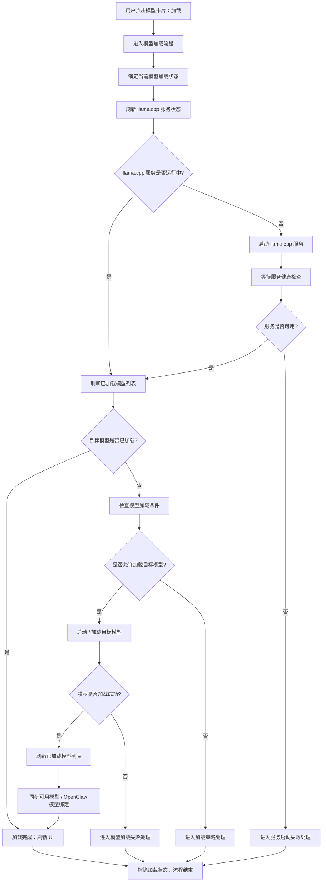
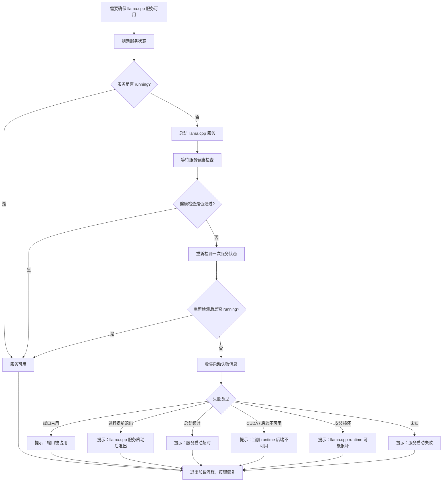
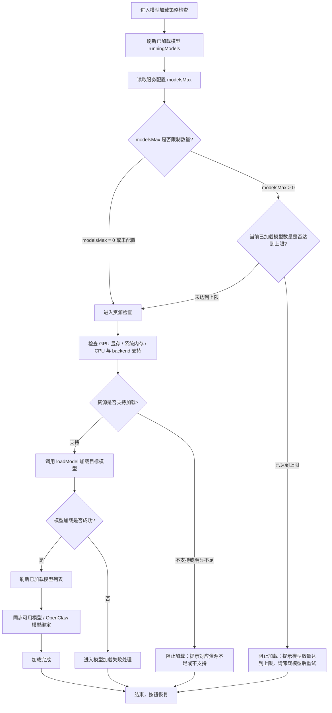
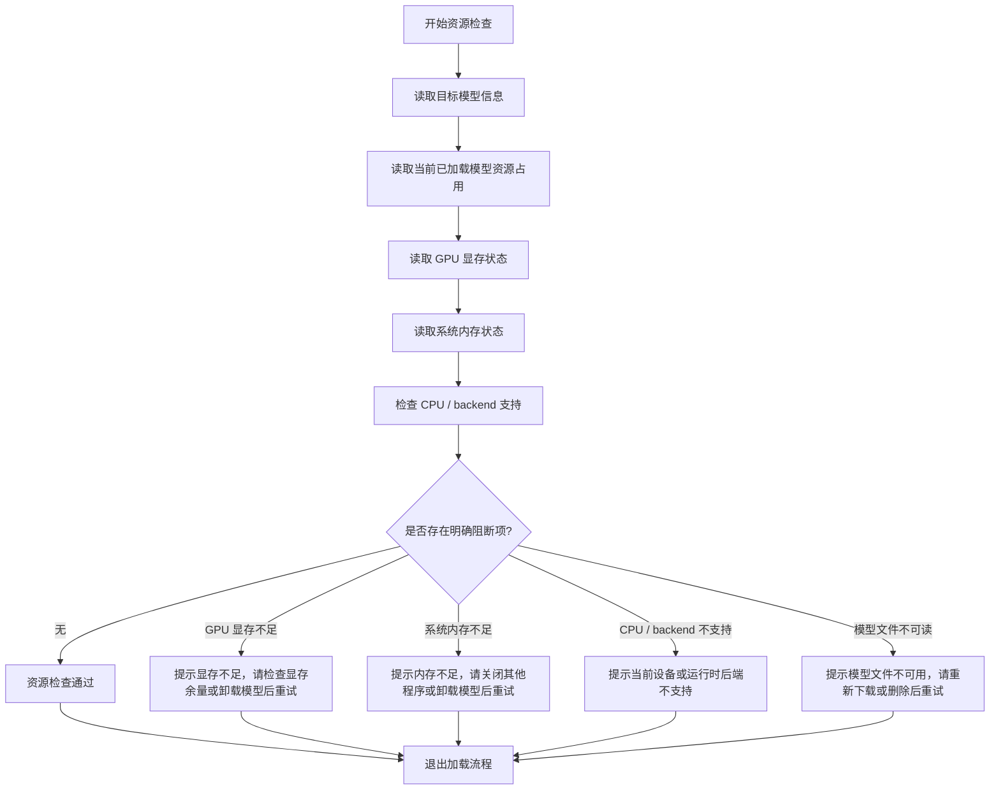
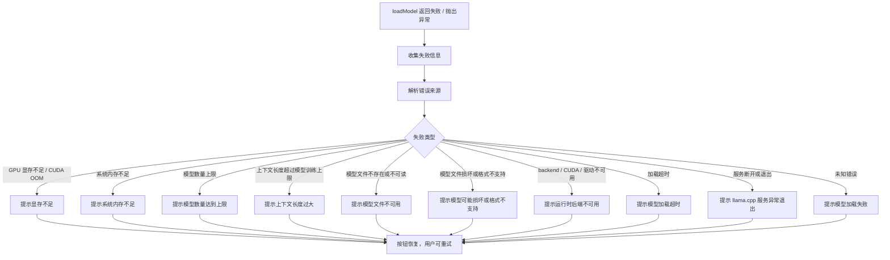
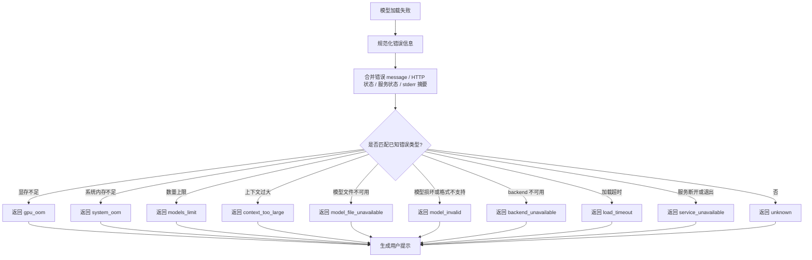
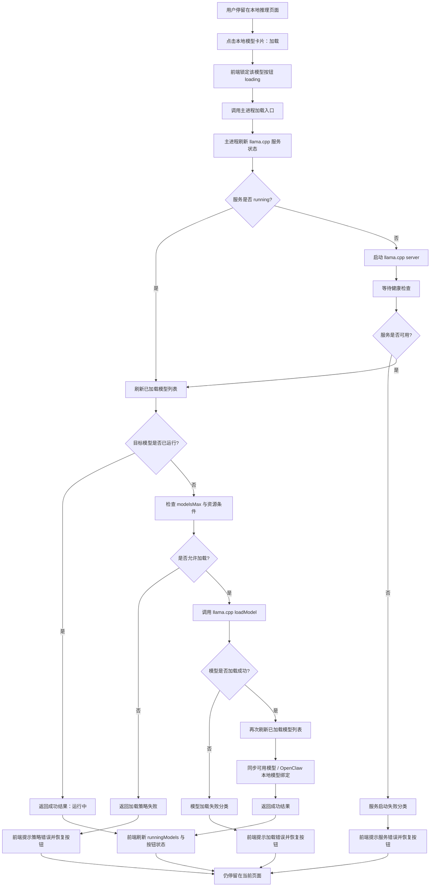
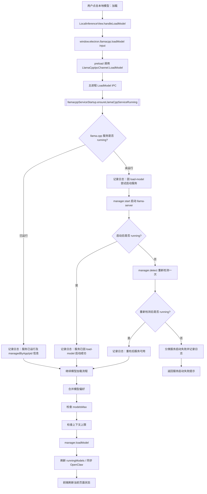
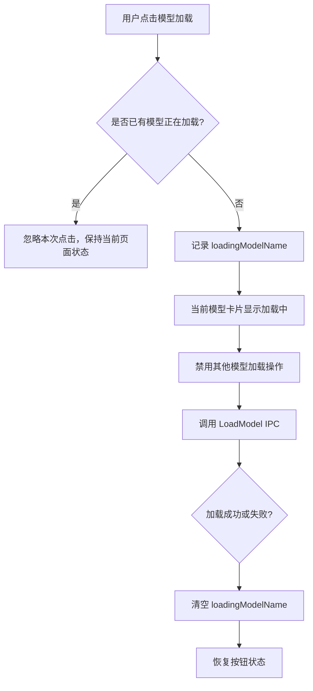
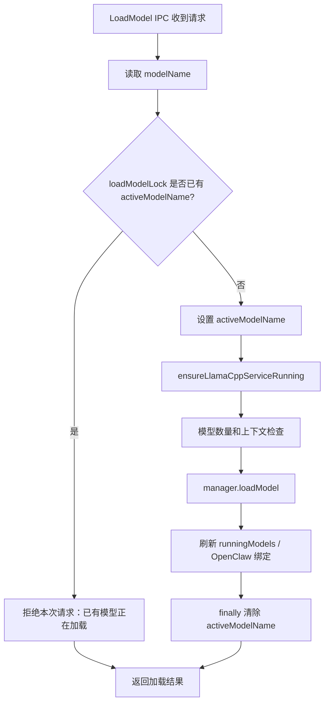

## 第二步：本地模型加载流程设计

本阶段目标是在本地推理的本地模型列表中优化“加载”操作：用户点击模型卡片的“加载”后，系统自动确保 llama.cpp 服务可用，再加载目标本地模型。当前先冻结执行流程与策略，后续再进入具体实现。

### 已确认设计约束

1. llama.cpp runtime 已由 Windows NSIS 安装阶段完成，本阶段不把 runtime 未下载作为常规路径处理，也不设计普通的 `not-installed` 下载流程。
2. llama.cpp server 由 Electron 主进程继续管理，不引入第三方进程守护库。
3. llama.cpp server 支持同时加载多个模型，当前设计准则是支持多模型并存。
4. 暂不支持自动切换模型；达到数量或资源限制时，只提示用户自行卸载模型后重试。
5. 用户点击“加载”后，若服务未运行，则自动启动服务；服务可用后再加载目标模型。
6. 模型已加载后，前端应显示“运行中”，不提供重新加载入口，因此模型加载策略中暂不考虑重复加载已运行模型。
7. 错误提示面向普通用户，直接说明“显存不足”“系统内存不足”等原因，不展示原始错误摘要，也不提供查看日志入口。

### 整体执行流程图



### 服务启动处理流程

服务启动阶段不考虑 runtime 未下载的普通分支。若服务启动失败，只重新检测一次；重新检测后仍不可用，则退出加载流程并提示错误原因。



服务启动失败分类暂按以下类型处理：端口占用、进程提前退出、启动超时、CUDA/backend 不可用、安装损坏、未知错误。未知错误也只给出通用启动失败提示，不向用户展示原始错误摘要。

### 模型加载策略流程

模型加载前先检查模型数量限制和资源条件。`modelsMax = 0` 或未配置视为不限制数量；`modelsMax > 0` 且未达到上限时允许继续加载；`modelsMax > 0` 且已达到上限时阻止加载，并提示模型数量达到上限，请卸载模型后重试。



### 资源检查子流程

加载多个模型时需要考虑 GPU 显存、CPU 资源、系统内存和当前 backend 支持能力。如果存在明确阻断项，应在调用 `loadModel` 前退出并提示用户。



资源检查只能作为预检查，不能保证 100% 准确。即使预检查通过，`loadModel` 仍可能因为 llama.cpp 实际加载过程中的资源分配、模型文件、backend 或超时问题失败。因此需要保留加载失败后的分类提示。

### 模型加载失败分类流程

该流程处理 `loadModel()` 已被调用但返回失败或抛出异常的情况。失败后不展示原始错误摘要，不引导用户查看日志，只转化为用户可理解的分类提示。



### 模型加载失败分类子流程



### 用户提示方向

- 模型数量达到上限，请卸载模型后重试。
- GPU 显存不足，请检查显存余量或卸载模型后重试。
- 系统内存不足，请关闭其他占用内存的程序或卸载模型后重试。
- 当前设备或 llama.cpp 运行时后端不可用，请检查显卡驱动或运行时配置。
- 模型文件不可用，请重新下载或删除后重试。
- 模型文件可能损坏或格式不支持，请重新下载后重试。
- 上下文长度过大，请降低上下文长度后重试。
- 模型加载超时，请稍后重试。
- llama.cpp 服务异常退出，请重试。
- 模型加载失败，请稍后重试。


### 本轮冻结：llama.cpp 执行逻辑

本轮已切换到当前项目目录 `C:\code\RongxinAI`，此前在其他工作区中的实现不视为已存在。本轮从头执行时，先冻结 llama.cpp 的执行逻辑，再进入代码修改，以降低后续与 `origin/dev` rebase 时的冲突概率。

#### 执行边界

1. Windows NSIS 安装阶段已经负责安装 llama.cpp runtime，本阶段不实现 runtime 下载流程。
2. 应用启动时不主动加载模型；模型加载由用户在本地模型列表点击“加载”触发。
3. 用户点击一次“加载”，业务语义是：确保 llama.cpp server 可用，然后加载目标模型。
4. llama.cpp server 仍由 Electron 主进程管理，不引入第三方进程守护库。
5. 设计上支持多个模型并存运行；暂不支持自动切换模型。
6. 如果达到模型数量上限，只提示“模型数量达到上限，请卸载模型后重试”，不明确推荐卸载哪个模型。
7. 如果资源不足，应按资源类型提示，例如显存不足、系统内存不足、backend 不可用等。
8. 成功或失败后，用户仍停留在当前页面，由当前页面刷新运行状态和按钮状态。

#### 总体业务执行链路



#### 主进程函数调用逻辑

```mermaid
sequenceDiagram
  participant UI as LocalInferenceView
  participant Preload as preload llamacpp API
  participant IPC as llamacpp IPC handler
  participant Activate as model activation helper
  participant Service as service startup helper
  participant Manager as LlamaCppManager
  participant Client as llama.cpp HTTP API
  participant OpenClaw as OpenClaw binding sync

  UI->>Preload: llamacpp.loadModel(input)
  Preload->>IPC: invoke LoadModel
  IPC->>Activate: activateLocalModel(input)

  Activate->>Service: ensureLlamaCppServiceRunning(manager)
  Service->>Manager: detect()
  alt service already running
    Service-->>Activate: service ready
  else service not running
    Service->>Manager: start()
    Manager->>Client: health check
    alt startup failed
      Service->>Manager: detect() once more
      Service-->>Activate: classified service failure
    else startup succeeded
      Service-->>Activate: service ready
    end
  end

  Activate->>Manager: listRunningModels()
  Activate->>Activate: check target model state
  Activate->>Activate: check modelsMax / resource preconditions

  alt target model can be loaded
    Activate->>Manager: loadModel(input)
    Manager->>Client: POST /models/load
    Activate->>Manager: listRunningModels()
    Activate->>OpenClaw: sync running local models
    Activate-->>IPC: success result
  else blocked or failed
    Activate-->>IPC: classified failure result
  end

  IPC-->>Preload: result
  Preload-->>UI: result
  UI->>UI: refresh current page state
```

#### 服务启动 helper 职责

本轮先实现 llama 服务部分时，服务启动 helper 只负责把“服务是否可用”判断收敛到主进程，不直接处理模型加载策略。

输入：

- `manager.detect()`：读取当前服务状态。
- `manager.start()`：在服务未运行时启动 server。
- 可选 `manager.getStatus()`：用于补充当前状态快照。

输出：

- 成功：服务已处于 running，可继续进入模型流程。
- 失败：返回分类后的服务启动失败原因。

失败分类暂定为：

1. `port-in-use`：端口占用。
2. `process-exited`：服务启动后提前退出。
3. `startup-timeout`：启动或健康检查超时。
4. `backend-unavailable`：CUDA、GPU backend 或运行时后端不可用。
5. `runtime-damaged`：runtime 缺失、路径异常或疑似安装损坏。
6. `unknown`：无法归类的启动失败。

服务启动失败时，只重新检测一次；重新检测后仍不可用则退出加载流程，由前端显示用户可理解的提示。

#### 后续代码落点建议

为降低与 `origin/dev` rebase 的冲突，本轮代码实现优先新增小模块，尽量少改大文件：

1. 新增 `src/main/libs/llamacppServiceStartup.ts`：封装服务确保与启动失败分类。
2. 新增 `src/main/libs/llamacppServiceStartup.test.ts`：覆盖服务已运行、启动成功、启动失败重检、端口占用、超时、backend 不可用、runtime 损坏等场景。
3. 仅在必要时从 `src/main/libs/llamacppManager.ts` 导出 helper，避免直接重写 manager 主体逻辑。
4. 模型加载编排、资源检查、错误提示和前端 UI 刷新在后续步骤继续拆分实现。

### 本轮补充：llamacppServiceStartup 可观测流程

当前点击“加载”时，必须把 `llamacppServiceStartup` 作为明确的主进程流程节点，而不是隐藏在 `LoadModel` IPC 内部。这样测试时可以通过日志确认是否真正进入服务确保流程。

#### 当前点击加载调用流程



#### 日志可观测点

主进程日志需要能回答三个问题：

1. 点击加载是否进入了 `llamacppServiceStartup`。
2. 该流程是否真的调用了 `manager.start()`。
3. 如果服务已经 running，当前进程是否认为它是本应用管理的服务。

预期日志语义如下：

```text
[LlamaCpp] ensuring service before loading model
[LlamaCpp] service is already running before loading model, managed by this app
[LlamaCpp] service is already running before loading model, detected as external or leftover process
[LlamaCpp] starting service before loading model
[LlamaCpp] service is ready before loading model
[LlamaCpp] service startup failed before loading model
```

#### running 原因判断边界

当前 `manager.detect()` 能判断：

- `managedByApp = true`：当前 Electron 进程持有 llama-server 子进程，通常说明本进程曾启动过服务。
- `managedByApp = false`：当前端口上存在可访问的 llama.cpp 服务，但不属于当前 Electron 进程管理，可能是外部进程、旧进程残留、用户手动启动或其他程序占用同端口服务。

因此本阶段先通过日志明确区分：

1. `load-model` 流程本次启动的服务。
2. 进入 `load-model` 前已经 running 且由当前 app 管理的服务。
3. 进入 `load-model` 前已经 running 但不是当前 app 管理的服务。

如果后续需要更精确地区分“手动启动 / 重启 / 自动加载模型启动”，需要继续在 `LlamaCppManager` 层记录 `lastStartupReason`，并让所有启动入口都传入 reason。

### 本轮补充：模型加载并发控制

本阶段确认不支持同时启动多个模型。即使 llama.cpp server 支持多个模型并存，也要求用户一次只能发起一个模型加载流程，避免服务启动、模型 preset 写入、资源占用判断和 OpenClaw 绑定同步产生竞态。

#### 前端锁定策略



#### 主进程互斥策略



#### 当前用户提示

如果绕过前端或极端情况下产生并发 `LoadModel` 请求，主进程返回：

- 中文：已有模型正在加载，请等待完成后再试。
- 英文：A model is already loading. Wait for it to finish and try again.

## 开发交流记录：llama 操作实现

### 第 1 项：加载操作入口与现有调用链

本轮先确认“用户点击本地模型卡片的加载按钮”这一项的执行边界。当前代码中，加载入口已经存在，但服务确保逻辑主要分散在前端，后续实现应把核心执行语义收敛到主进程，避免不同 UI 入口重复拼流程。

#### 当前代码调用链

1. 前端入口：`src/renderer/components/localInference/LocalInferenceView.tsx`
   - `handleLoadModel(model)` 是模型卡片加载按钮的入口。
   - 当前流程：`runAction()` → `ensureLlamaCppRunning()` → 构造 `LlamaCppModelLaunchInput` → `window.electron.llamacpp.loadModel(input)` → `setRunningModels(result.runningModels)` → `notifyLlamaCppRunningModelsChanged()`。
   - `ensureLlamaCppRunning()` 当前会根据状态执行安装、启动或刷新；其中 `not-installed` 会调用 `window.electron.llamacpp.install()`，这与本阶段“runtime 已由安装阶段完成，不设计普通 not-installed 下载流程”的约束需要对齐。

2. Preload 暴露：`src/main/preload.ts`
   - `window.electron.llamacpp.loadModel(input)` 映射到 `ipcRenderer.invoke(LlamaCppIpcChannel.LoadModel, input)`。
   - `start/status/listRunningModels/listLocalModels/unloadModel` 等也通过同一个 `llamacpp` namespace 暴露。

3. IPC 常量：`src/shared/llamacpp/constants.ts`
   - `LlamaCppIpcChannel.LoadModel = 'llamacpp:load-model'`。
   - 继续遵守项目规则：IPC channel 必须使用常量，不新增裸字符串。

4. 主进程 IPC：`src/main/ipcHandlers/llamacpp.ts`
   - `registerLlamaCppIpcHandlers()` 注册 `LlamaCppIpcChannel.LoadModel`。
   - 当前 `LoadModel` 处理逻辑包括：校验模型名、合并模型偏好、检查 `modelsMax`、检查上下文长度上限、调用 `manager.loadModel()`、刷新 OpenClaw running model binding。
   - 当前 `LoadModel` 不主动启动 llama.cpp 服务；它依赖前端先调用 `ensureLlamaCppRunning()`。

5. 主进程管理器：`src/main/libs/llamacppManager.ts`
   - `detect()`：检查服务健康；不通时查找本地 executable，并返回 `running/installed/not-installed` 等状态。
   - `start()`：查找 executable、创建模型目录和 preset 文件、拼接 `llama-server` 参数、`spawn()` 子进程、等待健康检查。
   - `loadModel(input)`：写入模型 preset，创建 client，调用 router 接口加载模型，并记录最后加载模型和运行时上下文长度。
   - `listRunningModels()`：通过 client 查询 `/models`，筛选 `loaded/loading/sleeping`。

6. llama.cpp HTTP client：`src/main/libs/llamacppClient.ts`
   - 健康检查：`GET /health`。
   - 模型列表：`GET /models?reload=1` 或 `GET /models`。
   - 加载模型：`POST /models/load`，body 为 `{ model }`。
   - 卸载模型：`POST /models/unload`，body 为 `{ model }`。

#### 第 1 项建议结论

- 将“点击加载后确保服务可用再加载模型”的核心语义放到主进程 `LlamaCppIpcChannel.LoadModel` 或其调用的主进程 helper 中。
- 前端仍保留按钮 loading、toast、状态刷新等 UI 职责，但不要再把“安装 runtime / 启动服务 / 加载模型”的完整业务流程散落在前端。
- 本阶段加载流程遇到 `not-installed` 时不走普通下载流程；应转换为面向用户的 runtime 不可用/安装损坏类提示。
- `manager.start()` 可以作为服务启动动作继续复用；但需要在加载流程中增加“启动失败分类”和“一次重新检测”的封装。
- `manager.loadModel()` 继续负责实际调用 llama.cpp `/models/load`；加载前后的策略检查、错误分类和 OpenClaw 同步由 IPC 层或新 helper 统一编排。

#### 待确认问题

是否确认把“确保 llama.cpp 服务可用”从前端 `ensureLlamaCppRunning()` 下沉到主进程 `LoadModel` 流程中，让模型卡片加载按钮只发起一次 `window.electron.llamacpp.loadModel(input)` 调用？

### 第 1 项修正：先以已认可执行流程为准

用户已明确：当前阶段先不讨论代码下沉、前后端职责重分配等实现决策，先从流程图本身说明并冻结暂时认可的执行流程。后续所有代码逻辑讨论都应围绕该流程逐项展开。

#### 暂时认可的整体执行流程


#### 对该流程的解释

1. `锁定当前模型加载状态` 是流程互斥入口：防止同一个模型重复点击，也防止 UI 在加载过程中出现状态跳变。
2. `刷新 llama.cpp 服务状态` 是每次加载前的真实状态确认，不只依赖前端缓存状态。
3. 如果服务已运行，直接进入 `刷新已加载模型列表`；如果未运行，则进入服务启动与健康检查。
4. `等待服务健康检查` 的结果决定是否继续模型检查；服务不可用时不进入模型加载阶段。
5. `刷新已加载模型列表` 是加载前的事实来源，用于判断目标模型是否已经运行。
6. 如果目标模型已经加载，则直接进入完成分支，只刷新 UI，不重复调用加载接口。
7. 如果目标模型未加载，则进入 `检查模型加载条件`，包括数量限制、资源条件、模型文件可用性、上下文配置等。
8. 只有 `是否允许加载目标模型` 为“是”时，才真正调用加载动作。
9. 加载成功后必须再次刷新已加载模型列表，避免 UI 使用旧状态。
10. 成功刷新后同步可用模型 / OpenClaw 模型绑定，保证 Cowork/OpenClaw 侧可见最新本地模型。
11. `服务启动失败处理`、`加载策略处理`、`模型加载失败处理` 都是终止分支，最终都需要解除加载状态并恢复按钮。

#### 后续讨论顺序建议

后续应按流程节点逐项讨论，而不是直接跳到代码改造：

1. 先讨论 `锁定当前模型加载状态` 的语义与状态粒度。
2. 再讨论 `刷新 llama.cpp 服务状态` 如何判断 running / installed / error。
3. 再讨论 `服务未运行时启动服务 + 健康检查`。
4. 再讨论 `刷新已加载模型列表 + 判断目标模型是否已加载`。
5. 再讨论 `检查模型加载条件`。
6. 再讨论 `loadModel 成功/失败分类`。
7. 最后再映射到具体文件和代码职责。

### Codex 会话回溯：第二步执行流程最早交流记录

已在本机 Codex 会话记录中定位到“第二步执行流程”的最早交流会话。

- 会话 ID：`019f3733-b9df-7380-ad0b-07708720a3fb`
- 会话文件：`C:\Users\rxzn-wxy\.codex\sessions\2026\07\06\rollout-2026-07-06T19-32-44-019f3733-b9df-7380-ad0b-07708720a3fb.jsonl`
- 会话 cwd：`C:\code\RongxinAI-dev`
- 会话开始时间：2026-07-06 19:32:44（Asia/Shanghai）

#### 最早需求入口

2026-07-06 19:33:17，用户提出：

> 好了，我要实现第二步操作了，请先跟我交流需求，等我确认之后再执行代码

#### 第二步目标首次明确

2026-07-06 19:45:01，用户明确第二步目标：

> 我在第一步修改了 cpp 的安装操作到 NSIS，使得 app 在启动时已经下载和安装了 llama 服务。
> 下一步的流程是修改本地推理的启动操作。其中，在本地推理的本地模型的已注册模型中，有一个推理 button，用户点击推理时，执行流程如下：
> 系统先自动启动 llama 服务，再启动本地模型。
> 这样用户点击一个操作，即可执行模型。

#### 该会话中形成的早期理解

当时对第二步的理解是：

1. 入口位于“本地推理 → 本地模型 → 已注册模型”列表。
2. 用户点击某个模型的“推理/加载”按钮。
3. 系统自动确保 llama.cpp 服务启动。
4. 等待服务可用后加载用户点击的本地模型。
5. 用户不需要再手动分别点击“启动服务”和“启动模型”。

#### 后续同一会话中的关键推进

- 用户后续提出：“我们一项项的将你提出的进行修改，先修改执行流程图”。
- 用户随后接受该逻辑，并要求“详细写入开发文档”，同时希望补充函数调用逻辑或执行流程，与之前流程对应。
- 该会话后续还进入过“只修改 llama 服务部分”的代码阶段，并新增过 `llamacppServiceStartup` 相关能力。

#### 当前会话与最早会话的关系

当前 `开发文档.md` 中的第二步流程，是在上述最早会话基础上继续细化后的版本。当前阶段应以用户最新认可的流程图为准，但可回溯该会话理解最初目标：一键从模型卡片触发“启动服务 + 加载模型”。


